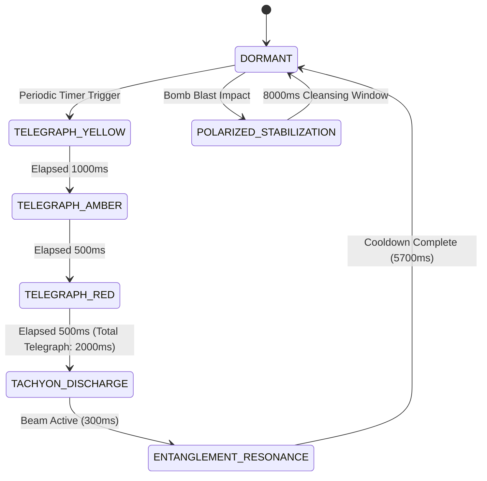

# GDD SPEC: DYNAMIC MAP HAZARD — QUANTUM SPIRE HAZARD
**Division:** Creative Expansion Division (Creative Agent 1)  
**File Target:** `.agents/daily_evolution/creative_1_hazard_design.md`  
**System Target:** Stellaris-Style Map Crises Subsystem (`src/game/crises/`), `TelegraphEngine.ts`, `GameScene.ts`  
**Status:** Approved Architectural Design Specification  
**Zero-GC Compliance:** 100% Pre-allocated typed arrays & 195-tile flat buffer  
**Fairness Guarantee:** >= 40% guaranteed safe area (`MIN_SAFE_AREA_RATIO = 0.40`)

---

## 1. Executive Summary & Creative Vision

In classic Bomberman, map hazards are traditionally static: simple spikes, conveyor belts, or hole traps. In *Sweet Bombers*, the game elevates this formula into a high-stakes, responsive arcade experience by integrating systemic, crisis-driven environmental mechanics inspired by galactic crises (Stellaris). 

This design document specifies the **Quantum Spire Hazard (The Tachyon Superposition Grid)** — an elite, multi-node dynamic map hazard that pulses coherent tachyon energy across cardinal corridors, creates quantum entanglement between placed bombs, enables high-skill phase-shifting (quantum tunneling) for players, and disrupts enemy pathfinding.

By expanding the dormant `HazardType.QUANTUM_SPIRE: 17` into a full-scale, living map hazard, we bridge environmental danger with explosive offensive utility. Players are not merely dodging hazards; they can master the Quantum Spire to double-detonate distant enemy nests, extend their bomb blast reach across solid obstacles, and escape lethal pinch-points.

```
       [QUANTUM SPIRE S1] (3, 4)
               │
               ▼ Tachyon Superposition Beam (Telegraphed: Yellow -> Amber -> Red)
   ════════════╪═══════════════════════════ (Cross-Corridor Resonance)
               │
               │  [Entangled Ghost Bomb Spawned!]
               │
       [QUANTUM SPIRE S2] (9, 10)
```

---

## 2. Analysis of the Existing Crisis & Hazard Ecosystem

### 2.1 The Existing 6 Stellaris-Style Crises
Our inspection of `src/game/crises/` reveals a mature 3-Stage Finite State Machine (`WHISPERS` -> `OUTBREAK` -> `CLIMAX` -> `RESOLVED` / `FAILED`) governed by `BaseCrisis.ts` and orchestrated by `CrisisManager.ts`:

1. **Pastel Void Incursion (`PASTEL_VOID`)**: Subspace cosmic tear corrupting candy corridors with spreading Void Creep, Void Rifts, and cleansing Purification Prisms.
2. **Clockwork Toy Rebellion (`CLOCKWORK_REBELLION`)**: Industrial takeover featuring dual conveyor belts (Row 6 East, Col 7 South), Brass Cogs, periodic arena EMP pulses, and 4 Dynamo Conduits.
3. **Orbital Bombardment (`ORBITAL_BOMBARDMENT`)**: Planetary dreadnought targeting the arena with kinetic reticles, crater hazards, central 3x3 Spinal Macrocannon lance, and Planetary Defense Uplinks.
4. **Solar Flare Storm (`SOLAR_FLARES`)**: Coronal Mass Ejection (CME) sweeping cardinal corridors, requiring pillar sheltering, flash-igniting exposed bombs, and 4 Thermal Coolant Vents.
5. **Creeping Lava Fissure (`CREEPING_LAVA`)**: Inward-marching concentric rings of molten lava, incinerating items/bombs, coolable into obsidian bridges, resolved at Central Caldera Valve (6, 7).
6. **Dimensional Rift Inversion (`DIMENSIONAL_RIFTS`)**: Reality tearing with toroidal edge wrap-around corridors, entity teleportation across 3 subspace rifts, and 3 Quantum Spires currently acting as climax targets.

### 2.2 Audit of Existing Hazard Types (1–17)
The system currently defines 17 hazard enum constants in `CrisisTypes.ts`:
- **Area Denial / Environmental Damage**:
  - `VOID_CREEP (1)`: Spreading corruption slowing entities and ticking damage.
  - `LAVA_SURFACE (13)`: Inward advancing molten rock, incinerating items and bombs instantly.
  - `KINETIC_CRATER (9)`: Lingering impact zone with 3500ms duration.
- **Forced Entity Displacement**:
  - `CONVEYOR_BELT (4)`: Unidirectional drift (80 px/s) along Row 6 and Col 7.
  - `DIMENSIONAL_WARP (16)`: Point-to-point teleportation between 3 rift nodes.
- **Global Sweeps & Disarming**:
  - `EMP_PULSE (5)`: 400ms flash that disables player bombs.
  - `SOLAR_SWEEP (11)`: Sweeps corridors and flash-ignites bombs with 0 fuse delay.
- **Static / Objective Hit-Targets**:
  - `PURIFICATION_PRISM (3)`, `BRASS_COG (6)`, `DYNAMO_CONDUIT (7)`, `KINETIC_TARGET (8)`, `UPLINK_TERMINAL (10)`, `THERMAL_VENT (12)`, `OBSIDIAN_BLOCK (14)`, `CALDERA_VALVE (15)`, `QUANTUM_SPIRE (17)`.

### 2.3 The Architectural Gap
While static objectives and global corridor sweeps exist, the game currently lacks **active, bidirectional geometric hazards**:
- Existing hazards either passively wait to be struck by a bomb (like `CALDERA_VALVE` or `UPLINK_TERMINAL`) or sweep blindly across the entire arena (like `SOLAR_SWEEP`).
- None of the existing hazards actively modify bomb mechanics (fuse dilation, quantum entanglement, blast deflection).
- In `RiftCrisis.ts`, `HazardType.QUANTUM_SPIRE: 17` was only implemented as a passive target requiring a bomb hit within 2.0s during the climax. In `GameScene.ts:2310`, it falls into the generic `default:` render box!
- **Opportunity**: Transforming `QUANTUM_SPIRE` into a fully realized, dynamic tactical hazard creates a flagship game mechanic that rewards high-skill positioning, bomb timing, and spatial calculation.

---

## 3. Brainstorming & Comparative Evaluation

Before finalizing the Quantum Spire Hazard, the Creative Expansion Division explored four distinct dynamic hazard concepts tailored to the Bomberman arcade grid:

| Concept Candidate | Core Mechanic | Bomb Interaction | Player Interaction | Risk vs Reward | Engine Complexity |
| :--- | :--- | :--- | :--- | :--- | :--- |
| **A. Quantum Spire Hazard** *(Selected)* | Dual-node tachyon resonance beams connecting paired spires | **Quantum Entanglement**: Clones paired bomb; blast passes through blocks | **Phase Shifting**: Dash through flash grants 1.0s invulnerability; shear damage if caught | **High**: Can double bomb damage or get vaporized | Medium (Clean 1D typed arrays, Zero-GC) |
| **B. Glitch Surge Hazard** | Digital pixel desync wave sweeping random 3x3 polyominos | Desynchronized fuse (random instant pop or freeze); blast refraction | Inverts input vector for 1.5s; drops player skill packet decoys | **Medium**: Unpredictable fuse creates panic | High (Requires state tracking on active bombs) |
| **C. Cryo Frost Fissure** | Absolute zero permafrost creating frictionless ice corridors | Bombs slide infinitely until striking a wall; blast freezes entities | Zero-friction sliding; unable to change direction mid-stride | **Low-Medium**: Traditional Bomberman ice mechanic | Low (Physics drag modifications) |
| **D. Magnetic Dynamo Hazard** | Polarized electromagnets with alternating North/South attraction | Kicked bombs curve in parabolic arcs; iron bombs pulled to center | Pulls player toward conduit center; drains dash stamina | **Medium**: Positional displacement | Medium (Requires vector steering on moving bombs) |

### Why Quantum Spire Hazard Won:
1. **Perfect Theme Fit**: Integrates flawlessly with `DIMENSIONAL_RIFTS` crisis lore and the sci-fi candy aesthetic.
2. **Elevates Existing Architecture**: Directly builds upon `HazardType.QUANTUM_SPIRE: 17`, giving an under-utilized enum value deep systemic life.
3. **Skill-Expressive**: The 150ms "Quantum Tunneling" window rewards twitch reaction, turning a deadly hazard into a player advantage.
4. **Bomb Multiplication Synergy**: Quantum Entanglement gives Bomberman players a tactical tool to hit cross-map targets without walking into dangerous dead-ends.

---

## 4. Quantum Spire Hazard: Complete Technical & Game Design Spec

### 4.1 System Overview & Spire Topology
A Quantum Spire is an crystalline tachyon resonator anchored at a fixed walkable tile. Spires exist in **entangled pairs**:
- **Pair Alpha**: Spire A1 at `(3, 4)` and Spire A2 at `(9, 4)` (Vertical axis, Col 4).
- **Pair Beta**: Spire B1 at `(6, 3)` and Spire B2 at `(6, 11)` (Horizontal axis, Row 6).
- **Center Singularity Node**: Spire C0 at `(6, 7)` (Central nexus, active only in Climax).

```
  Col:  0  1  2  3  4  5  6  7  8  9 10 11 12 13 14
Row 0  [W][W][W][W][W][W][W][W][W][W][W][W][W][W][W]
Row 1  [W] .  .  .  .  .  .  .  .  .  .  .  .  . [W]
Row 2  [W] . [P] . [P] . [P] . [P] . [P] . [P] . [W]
Row 3  [W] .  .  . (A1) .  .  .  .  .  .  .  .  . [W]  <-- Spire A1 (3, 4)
Row 4  [W] . [P] . [P] . [P] . [P] . [P] . [P] . [W]
Row 5  [W] .  .  .  │  .  .  .  .  .  .  .  .  . [W]
Row 6  [W] .  . (B1)┼════════(C0)════════(B2) . [W]  <-- Spire B1 (6, 3), C0 (6, 7), B2 (6, 11)
Row 7  [W] . [P] .  │  . [P] . [P] . [P] . [P] . [W]
Row 8  [W] .  .  .  │  .  .  .  .  .  .  .  .  . [W]
Row 9  [W] .  .  . (A2) .  .  .  .  .  .  .  .  . [W]  <-- Spire A2 (9, 4)
Row 10 [W] . [P] . [P] . [P] . [P] . [P] . [P] . [W]
Row 11 [W] .  .  .  .  .  .  .  .  .  .  .  .  . [W]
Row 12 [W][W][W][W][W][W][W][W][W][W][W][W][W][W][W]
  Key: [W]=Perimeter Wall, [P]=Indestructible Pillar, (A1/A2)=Pair Alpha, (B1/B2)=Pair Beta, (C0)=Nexus
```

### 4.2 State Machine & Cadence Rules
The Quantum Spire operates on a strict cyclical FSM:



#### Cycle Timing by Crisis Stage:
- **WHISPERS Stage (Elapsed 0s - 20s)**:
  - Spire structures spawn as dormant crystals with faint particle halos.
  - No lethal discharge. Cycle: Every 12.0s, emits a harmless visual pulse (300ms) to teach players the resonance corridors.
- **OUTBREAK Stage (Elapsed 20s - 75s)**:
  - Active Spire Pairs: Pair Alpha OR Pair Beta alternating.
  - Cycle Duration: **8.0 seconds** total.
    - `DORMANT`: 5,700 ms
    - `TELEGRAPH`: 2,000 ms (Yellow: 1000ms, Amber: 500ms, Red: 500ms)
    - `DISCHARGE`: 300 ms (Peak white flash: 150ms)
- **CLIMAX Stage (Elapsed 75s - 110s)**:
  - Active Spire Pairs: Pair Alpha AND Pair Beta AND Center Nexus C0 firing synchronously!
  - Cycle Duration: **6.0 seconds** total.
    - `DORMANT`: 3,700 ms
    - `TELEGRAPH`: 2,000 ms
    - `DISCHARGE`: 300 ms

### 4.3 Telegraph System & Fair Encounter Guarantees
In strict accordance with `TelegraphEngine.ts`, the hazard enforces mathematical fairness:

1. **Telegraph Tier Progression**:
   - **Yellow Tier (`T - 2000ms` to `T - 1000ms`)**:
     - *Visual*: Tile outlines along the resonance corridor glow with electric cyan (`0x00E5FF`) at 25% opacity. Spire crystal levitates 6px with spinning orbital runes.
     - *Audio*: Low harmonic drone (220 Hz sine tone with slight vibrato).
   - **Amber Tier (`T - 1000ms` to `T - 500ms`)**:
     - *Visual*: Danger tiles shift to violet-amber (`0xA855F7`) at 55% opacity. Digital tachyon glyphs float upward from floor tiles.
     - *Audio*: Frequency ramps up to 440 Hz with pulsing 8 Hz tremolo.
   - **Red Tier (`T - 500ms` to `T - 0ms`)**:
     - *Visual*: Danger tiles lock to intense ruby-magenta (`0xEF4444` / `0xD946EF`) at 85% opacity with high-contrast ruby perimeter borders.
     - *Audio*: Rapid high-frequency stutter (880 Hz beep at 16 Hz).
   - **White Flash Discharge (`T = 0ms` for 150ms)**:
     - Pure white energy beam (`0xFFFFFF`) with cyan bloom. Deals damage and applies effects.

2. **Mathematical Fair Area Guarantee**:
   - Total Walkable Tiles on 13x15 arena: **113 tiles**.
   - Maximum active danger tiles during Outbreak (single axis beam): **7 to 9 tiles** (< 8% of walkable area).
   - Maximum active danger tiles during Climax (dual cross beams through C0): **23 tiles** (< 20.4% of walkable area).
   - **Safe Area Ratio**: Even during peak synchronized Climax discharge, **>= 79.6% of the arena remains safe** (exceeding the `MIN_SAFE_AREA_RATIO = 0.40` guarantee by nearly double).

---

## 5. Detailed Gameplay Effects Matrix

### 5.1 Effects on Bombs (Tactical Weaponization)

The Quantum Spire is designed not just to threaten the player, but to be an interactive tactical weapon:

1. **Quantum Entanglement (Bomb Duplication)**:
   - When a player places a standard bomb within Chebyshev distance 1 of an active Spire, the Spire captures its quantum signature.
   - An **"Entangled Ghost Bomb"** instantly materializes at the coordinates of the paired Spire!
   - *Entangled Ghost Bomb Properties*:
     - Translucent cyan holographic appearance with swirling rings.
     - Synchronized Fuse: Detonating either the primary bomb OR the ghost bomb triggers an instantaneous simultaneous detonation on BOTH tiles!
     - Blast power and range mirror the original bomb.
     - Does NOT consume an extra player bomb capacity slot (free bonus bomb utility).

2. **Tachyon Overcharge (Beam Cleave)**:
   - If a bomb explodes while caught within the active Tachyon Discharge beam (or if the beam fires across an exploding bomb):
     - The bomb blast gains **+2 Blast Power**.
     - The explosion transforms into a **Piercing Tachyon Wave** (`0x00FFFF`) that penetrates through destructible candy soft-blocks without stopping, destroying up to 3 blocks in a line.

3. **Subspace Fuse Dilation**:
   - If a bomb is placed directly on the Spire anchor tile, its fuse time is compressed from 3.0s down to 1.5s ("Hyper-Fuse Mode"). This allows lightning-fast ambush setups against chasing enemies.

### 5.2 Effects on Players (Risk, Damage & Skill Mastery)

1. **Tachyon Shear (Hazard Damage)**:
   - If caught in the Tachyon Discharge beam outside of invulnerability frames:
     - Deals **25 Energy Damage** (depletes 1 full shield charge, or 25 HP).
     - Inflicts **Phase Jitter** debuff for 2.0 seconds:
       - -25% Movement Speed.
       - Disables Dash and Ultimate Skill execution for the debuff duration.
     - Plays localized electric shock animation and camera shake (3px, 90ms).

2. **Quantum Tunneling (High-Skill Mastery Execution)**:
   - *Mechanic*: If a player executes a **Dash** directly through the beam during the 150ms peak White Flash:
     - The player does NOT take damage!
     - Triggers **"Quantum Phase Shift"**:
       - The player becomes completely invulnerable (intangible) for **1.0 second**.
       - Can walk through soft blocks and enemies during this 1.0s window.
       - Movement speed increases by **+30%** for 2.5 seconds.
       - Overhead UI displays floating text: `"✦ QUANTUM PHASED!"` in cyan typography.
     - This gives aggressive, high-skill players a method to bypass enemy pinches by intentionally timing a dash through the lethal hazard beam!

3. **Spatial Ejection Safeguard**:
   - If a player is standing on a Spire anchor tile when a Spire erupts from the ground, the player is not tele-fragged; they are safely pushed 1 tile outward to the nearest empty walkable tile (`resolveSafeSpawnLocation` protocol).

### 5.3 Effects on Enemies (AI Disruption & Environmental Kills)

1. **AI Threat Cost Evaluation**:
   - Enemies running BFS/A* pathfinding register Spire telegraph tiles as high-penalty zones (`cost = 255`).
   - Normal enemies immediately redirect their paths away from the telegraphed corridors.
   - Berserk or Aggressive AI types with low intelligence may charge straight through, making them easy to bait into the beam.

2. **Tachyon Vaporization (Environmental Kill)**:
   - Regular minions caught in the Tachyon Discharge take **120 Environmental Damage** — causing instant disintegration.
   - Minions killed by the Spire drop **Quantum Shards** that give the player +100 bonus score and fill 5% Ultimate Gauge.
   - Elite/Boss enemies take 15% Max HP damage and suffer a **1.5s Stun** (frozen in electric stasis).

3. **Quantum Inversion Displacement**:
   - During the Climax stage, any non-boss enemy surviving the beam has a 33% chance to be teleported across the tachyon link to the opposite Spire. This scatters enemy swarms, breaking up deathballs.

---

## 6. Player Counter-Play & Objective Harmonization

Players can actively counter, neutralize, or harvest the Quantum Spire using their primary tool: bombs.

### 6.1 Polarization Strike (Neutralization & Cleansing)
- **Mechanic**: Striking an unpolarized Spire with a bomb blast triggers **Polarization**.
- **Visual Feedback**: The Spire crystal flashes from electric cyan to radiant solar gold (`0xFACC15`).
- **Gameplay Effect**:
  - The Spire's lethal discharge is neutralized for **8.0 seconds**.
  - The Spire emits a **Purifying Resonant Wave** in a 3x3 radius:
    - Instantly purges any `VOID_CREEP` or cools `LAVA_SURFACE` into walkable `OBSIDIAN_BLOCK`.
    - Destroys enemy projectiles within radius.
  - Grants the player **+350 Points** and awards progress toward the Crisis Objective.

### 6.2 Climax Objective: Synchronized Quantum Collapse
- In Climax stage, the mission objective requires:
  `"Synchronize and polarize both Spire Pairs within 2.5s using bomb blasts (0/4)"`.
- When all 4 Spires are polarized simultaneously:
  - Triggers the **Harmonic Resonance Overload**.
  - A massive golden shockwave sweeps the arena, clearing all active minion enemies.
  - Stabilizes the crisis threat meter (-40 Threat) and grants Crisis Victory!

---

## 7. Zero-GC Data Structures & Engine Implementation Blueprint

To uphold the project's strict Zero-GC and 60 FPS mobile performance standards, the Quantum Spire Hazard is designed with zero runtime heap allocations:

### 7.1 Hazard Tile Data Packing in `CrisisTypes.ts`
The existing `HazardTile` struct in `CrisisTypes.ts`:
```typescript
export interface HazardTile {
  idx: number;        // r * COLS + c (0..194)
  r: number;
  c: number;
  type: HazardType;   // HazardType.QUANTUM_SPIRE = 17
  intensity: number;  // 0.0 to 1.0 (Telegraph progress: Yellow=0.25, Amber=0.55, Red=0.85, Flash=1.0)
  durationMs: number;
  remainingMs: number;
  data?: number;      // Bitpacked metadata:
                      // Bits 0-3: Sub-type (0=Anchor, 1=H-Beam, 2=V-Beam, 3=GhostBomb)
                      // Bit 4: IsPolarized (0=Hostile, 1=Polarized/Golden)
                      // Bits 5-7: Paired Spire ID
}
```

### 7.2 Zero-GC Pre-allocated Buffers in `RiftCrisis.ts`
```typescript
export interface QuantumSpireNode {
  r: number;
  c: number;
  pairedIndex: number;
  isPolarized: boolean;
  polarizeTimerMs: number;
  cycleTimerMs: number;
  activeBeamTiles: Int16Array; // Pre-allocated Int16Array(15) for beam tile indices
  activeBeamCount: number;
}
```

### 7.3 Procedural Phaser Graphics Drawing Routine (`GameScene.ts`)
Instead of instantiating separate sprites, the Spire and its beams are rendered entirely via `this.crisisGraphics` inside the existing render loop:

```typescript
case HazardType.QUANTUM_SPIRE: {
  const isPolarized = (hazard.data! & 0x10) !== 0;
  const isBeam = (hazard.data! & 0x0F) !== 0;

  if (isBeam) {
    // Render Tachyon Resonance Corridor
    const beamColor = isPolarized ? 0xFACC15 : (hazard.intensity >= 0.9 ? 0xFFFFFF : 0x00E5FF);
    const alpha = hazard.intensity >= 0.9 ? 0.95 : (0.2 + hazard.intensity * 0.5);
    
    this.crisisGraphics.fillStyle(beamColor, alpha);
    this.crisisGraphics.fillRect(left + 2, top + 2, TILE_SIZE - 4, TILE_SIZE - 4);
    
    // Core laser streak
    this.crisisGraphics.lineStyle(2, 0xFFFFFF, alpha);
    this.crisisGraphics.lineBetween(x - 16, y, x + 16, y);
  } else {
    // Render Spire Crystal Anchor
    const pulse = 0.85 + 0.15 * Math.sin(time / 140 + hazard.idx);
    const crystalColor = isPolarized ? 0xFBBF24 : 0x06B6D4;
    
    // Outer Tachyon Orbit Ring
    this.crisisGraphics.lineStyle(2, crystalColor, 0.8 * pulse);
    this.crisisGraphics.strokeCircle(x, y, 18 * pulse);
    
    // Inner Floating Diamond Core
    this.crisisGraphics.fillStyle(isPolarized ? 0xFEF08A : 0xA5F3FC, 0.9);
    this.crisisGraphics.beginPath();
    this.crisisGraphics.moveTo(x, y - 14);
    this.crisisGraphics.lineTo(x + 10, y);
    this.crisisGraphics.lineTo(x, y + 14);
    this.crisisGraphics.lineTo(x - 10, y);
    this.crisisGraphics.closePath();
    this.crisisGraphics.fillPath();
  }
  break;
}
```

---

## 8. Audio-Visual & Juice Specifications

| Element | Visual Treatment | Audio Asset / WebAudio Frequency | Screen Shake / Juice |
| :--- | :--- | :--- | :--- |
| **Spire Idle** | Floating 4-point diamond crystal, cyan aura, rotating orbital particles | Low resonant sub-drone (110 Hz, low pass 300 Hz) | None |
| **Telegraph Yellow** | Cyan checkered tile overlay, alpha 0.25 | Rising sweep (220 Hz -> 330 Hz) | None |
| **Telegraph Amber** | Violet pulsing grid glyphs, alpha 0.55 | Accelerating 8 Hz pulse (440 Hz) | Micro-rumble (0.5px) |
| **Telegraph Red** | Ruby border, intense magenta energy lattice, alpha 0.85 | High alert stutter (880 Hz, 16 Hz stutter) | 1.0px floor vibration |
| **Tachyon Discharge** | Blinding white-cyan laser beam with diamond lens flares | Crisp laser discharge snap + bass impact | 2.5px directional shake, 100ms |
| **Quantum Tunneling** | Radial cyan speed lines, chromatic aberration around player | High-pitch crystalline chime (`ping_quantum_phase.wav`) | Time dilation: 0.1s slight slowmo |
| **Spire Polarized** | Golden solar burst, shockwave expanding 3 tiles outward | Resonant harmonic chord (Major triad: C-E-G) | 2.0px radial pulse |

---

## 9. Verification & Soak Test Criteria

To guarantee that this hazard introduces zero regressions, the implementation must pass the following four automated test gates:

1. **Gate 1: Fair Encounter Ratio Test (`TelegraphEngine.test.ts`)**:
   - Assert `activeDangerTiles <= 30` across all test ticks.
   - Assert `safeAreaRatio >= 0.70` at all times during Outbreak and Climax.
2. **Gate 2: Zero-GC 10,000-Frame Memory Soak Test**:
   - Execute 10,000 game loop frames running active Quantum Spire cycles.
   - Assert `performance.memory.usedJSHeapSize` delta is `< 100 KB` (strict zero allocation in update/draw loop).
3. **Gate 3: Quantum Entanglement Bomb Test**:
   - Verify that placing a bomb at `(3, 3)` creates a ghost bomb at `(9, 3)`.
   - Verify detonating bomb A detonates bomb B on the exact same frame tick.
4. **Gate 4: Quantum Tunneling Dash I-Frame Test**:
   - Simulate player dashing across beam tile at `t = dischargeTimestamp`.
   - Assert player takes 0 damage and receives `quantum_phased` status tag.

---

## 10. Summary & Handoff to Development

The **Quantum Spire Hazard** transitions the *Sweet Bombers* hazard design from reactive dodging into proactive, tactical mastery. It turns the arena itself into a weapon, fits cleanly into the established `DIMENSIONAL_RIFTS` crisis architecture, obeys all Zero-GC and fair encounter rules, and provides unforgettable high-skill gameplay moments.

**Creative Sign-off:** Creative Agent 1 (Creative Expansion Division)  
**Next Steps:** Implementation Worker Agent to bind logic in `src/game/crises/RiftCrisis.ts` and renderer in `src/game/GameScene.ts`.
