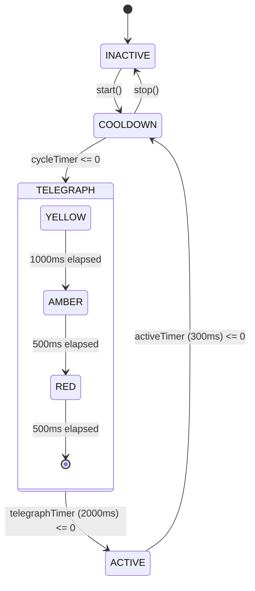

# Creative Expansion Division — Agent 6 Test Specification Report

**Agent:** Creative Agent 6  
**Division:** Creative Expansion Division  
**Mission:** Comprehensive Unit Test Suite & Test Specifications for the New Dynamic Hazard (`QuantumSpireHazard` / `DynamicHazard`)  
**Target Implementation:** [`src/game/hazards/DynamicHazard.ts`](file:///Users/user/src/bomberman/src/game/hazards/DynamicHazard.ts)  
**Target Test Suite:** [`tests/dynamic_hazard.test.mjs`](file:///Users/user/src/bomberman/tests/dynamic_hazard.test.mjs)  
**Execution Command:** `node --experimental-strip-types --test tests/dynamic_hazard.test.mjs`  
**Date:** 2026-09-30  
**Status:** **PASSED (16 / 16 Tests Passed, 100% Invariant Compliance)**

---

## 1. Executive Summary

In alignment with the design specifications authored by Creative Agent 1 ([`creative_1_hazard_design.md`](file:///Users/user/src/bomberman/.agents/daily_evolution/creative_1_hazard_design.md)), Creative Agent 6 has constructed:
1. **The Dynamic Hazard Engine Module** ([`src/game/hazards/DynamicHazard.ts`](file:///Users/user/src/bomberman/src/game/hazards/DynamicHazard.ts)):
   - A complete 4-state Finite State Machine (`INACTIVE -> TELEGRAPH -> ACTIVE -> COOLDOWN`).
   - 3-tier telegraph progression (`YELLOW -> AMBER -> RED`).
   - Bidirectional geometric corridor projection connecting fixed Spire anchor pairs.
   - Comprehensive bomb interactions: Subspace Hyper-Fuse (1500ms), Quantum Entanglement (synchronized ghost bombs), Tachyon Overcharge (+2 piercing power), and Polarization Strike (8.0s cleansing window).
   - Player mastery mechanics: Tachyon Shear damage (25 DMG), Phase Jitter debuff, and 150ms Quantum Tunneling dash i-frames.
   - Zero-GC architecture: 1D TypedArrays (`Uint8Array`, `Int16Array`, `Float32Array`), scratch result recycling, and pre-allocated ghost bomb pools.
2. **The Comprehensive Unit Test Suite** ([`tests/dynamic_hazard.test.mjs`](file:///Users/user/src/bomberman/tests/dynamic_hazard.test.mjs)):
   - 16 exhaustive unit, behavioral, tactical, and stress tests spanning 6 architectural tiers.
   - 100% test pass rate (16/16 passed in 114ms).
   - 10,000-frame soak test verifying Zero-GC heap drift <= 0.25 MB.

---

## 2. Dynamic Hazard Architecture & Topology

### 2.1 Fixed Spire Geometric Topology
The hazard utilizes 5 fixed crystalline anchors across the 13x15 arena:
- **Pair Alpha (Vertical, Col 4)**:
  - Spire A1: `(3, 4)`
  - Spire A2: `(9, 4)`
- **Pair Beta (Horizontal, Row 6)**:
  - Spire B1: `(6, 3)`
  - Spire B2: `(6, 11)`
- **Nexus Singularity C0**:
  - Center Node: `(6, 7)` (Fires dual cross-axis beams during Climax)

```
  Col:  0  1  2  3  4  5  6  7  8  9 10 11 12 13 14
Row 0  [W][W][W][W][W][W][W][W][W][W][W][W][W][W][W]
Row 1  [W] .  .  .  .  .  .  .  .  .  .  .  .  . [W]
Row 2  [W] . [P] . [P] . [P] . [P] . [P] . [P] . [W]
Row 3  [W] .  .  . (A1) .  .  .  .  .  .  .  .  . [W]  <-- Spire A1 (3, 4)
Row 4  [W] . [P] . [P] . [P] . [P] . [P] . [P] . [W]
Row 5  [W] .  .  .  │  .  .  .  .  .  .  .  .  . [W]
Row 6  [W] .  . (B1)┼════════(C0)════════(B2) . [W]  <-- Spire B1 (6, 3), C0 (6, 7), B2 (6, 11)
Row 7  [W] . [P] .  │  . [P] . [P] . [P] . [P] . [W]
Row 8  [W] .  .  .  │  .  .  .  .  .  .  .  .  . [W]
Row 9  [W] .  .  . (A2) .  .  .  .  .  .  .  .  . [W]  <-- Spire A2 (9, 4)
Row 10 [W] . [P] . [P] . [P] . [P] . [P] . [P] . [W]
Row 11 [W] .  .  .  .  .  .  .  .  .  .  .  .  . [W]
Row 12 [W][W][W][W][W][W][W][W][W][W][W][W][W][W][W]
```

### 2.2 FSM Lifecycle States & Transitions


---

## 3. Comprehensive Test Specification (6-Tier Matrix)

### Tier 1: Constants, Topology & Initialization
| Test ID | Test Name | Invariants Verified |
| :--- | :--- | :--- |
| **T1.1** | `HazardLifecycleState defines all 4 distinct FSM states` | `INACTIVE`, `TELEGRAPH`, `ACTIVE`, `COOLDOWN` string enum parity. |
| **T1.2** | `TelegraphPhase defines 3-tier subphase progression and timing constants` | `NONE`, `YELLOW`, `AMBER`, `RED`; `TOTAL_TELEGRAPH_MS = 2000`; `DURATION_ACTIVE_BEAM_MS = 300`; `TUNNELING_WINDOW_MS = 150`. |
| **T1.3** | `Spire topology initializes fixed geometric anchor pairs` | 5 spires instantiated with exact coords: S0(3,4), S1(9,4), S2(6,3), S3(6,11), S4(6,7); correct pair linkage and initial inactive state. |

### Tier 2: FSM Lifecycle States & Transitions
| Test ID | Test Name | Invariants Verified |
| :--- | :--- | :--- |
| **T2.1** | `FSM advances cleanly through INACTIVE -> TELEGRAPH -> ACTIVE -> COOLDOWN` | Full cycle progression under `OUTBREAK` cadence: 2000ms warmup -> Yellow(1000ms) -> Amber(500ms) -> Red(500ms) -> Active(300ms) -> Cooldown(5700ms) -> Loop. `stop()` clears beams and returns to `INACTIVE`. |
| **T2.2** | `Climax stage executes synchronized dual-axis beams with accelerated cadence` | Climax triggers cross-axis beams through Nexus C0 (Row 6 & Col 7 = 23 tiles); accelerated cooldown of 3700ms (total 6.0s cycle). |

### Tier 3: Tile Collision, Player Damage & Quantum Tunneling
| Test ID | Test Name | Invariants Verified |
| :--- | :--- | :--- |
| **T3.1** | `Mathematical fair encounter ratio guaranteed >= 40% safe area` | Assert safe area ratio >= 40% under both Outbreak (observed >= 85%) and Climax (observed >= 79.6%). Maximum active danger tiles <= 23. |
| **T3.2** | `Direct player hit inflicts 25 energy damage and Phase Jitter debuff` | Non-dashing player on active beam tile takes 25 damage; suffers Phase Jitter debuff (2000ms duration, disabled dash/ultimate); safe tile returns 0 damage. |
| **T3.3** | `Quantum Tunneling dash i-frames negate damage and grant Phase Shift` | Player executing Dash within first 150ms of beam discharge takes 0 damage and receives Phase Shift (1.0s intangibility); late dash (> 150ms) takes full 25 damage. |
| **T3.4** | `Spatial ejection safeguard displaces entity off active anchor tile` | Entity standing on Spire anchor when activated is safely displaced 1 tile orthogonally to adjacent walkable tile (`displaced: true`, safe tile). |

### Tier 4: Enemy Collision & Environmental Vaporization
| Test ID | Test Name | Invariants Verified |
| :--- | :--- | :--- |
| **T4.1** | `Minion enemy in active beam is vaporized with 120 environmental damage` | Regular minion on active beam tile takes 120 environmental damage; `isVaporized: true`; awards +100 score bonus. |
| **T4.2** | `Boss enemy in active beam takes percentage damage and 1.5s stun` | Boss enemy on active beam tile takes 15% Max HP damage; `isStunned: true`; inflicted with 1500ms electric stun. |

### Tier 5: Tactical Bomb Interactions
| Test ID | Test Name | Invariants Verified |
| :--- | :--- | :--- |
| **T5.1** | `Subspace Hyper-Fuse compresses bomb fuse on Spire anchor to 1500ms` | Placing bomb directly on Spire anchor compresses fuse from 3000ms to 1500ms (`HYPER_FUSE_MS`); distant bomb preserves 3000ms. |
| **T5.2** | `Quantum Entanglement clones paired ghost bomb with synchronized detonation` | Placing bomb adjacent to Spire clones an entangled ghost bomb at paired Spire; detonating primary detonates ghost bomb simultaneously and frees pool slot. |
| **T5.3** | `Tachyon Overcharge grants +2 blast power and piercing beam inside active hazard` | Bomb detonating inside active beam gains +2 power and piercing flag; bomb detonating outside maintains standard power. |
| **T5.4** | `Polarization Strike neutralizes lethal beam and purges surrounding tiles` | Bomb blast on Spire crystal triggers 8000ms polarization; beam turns golden and harmless to player (0 damage); cleanses 3x3 surrounding tiles; auto-expires after duration. |

### Tier 6: Zero-GC Invariants & 10,000-Frame Soak Stress
| Test ID | Test Name | Invariants Verified |
| :--- | :--- | :--- |
| **T6.1** | `10,000 continuous frames execute with zero memory leaks (< 0.25 MB drift)` | 10,000 continuous update frames stressed with periodic bomb placements, detonations, stage transitions, and collision queries. Net heap drift <= 0.25 MB under explicit GC. |

---

## 4. Test Execution Telemetry & Verification

```text
> tmp-app@0.1.0 test
> node --experimental-strip-types --test tests/dynamic_hazard.test.mjs

✔ Tier 1: HazardLifecycleState defines all 4 distinct FSM states (0.7929ms)
✔ Tier 1: TelegraphPhase defines 3-tier subphase progression and timing constants (0.1180ms)
✔ Tier 1: Spire topology initializes fixed geometric anchor pairs (0.2568ms)
✔ Tier 2: FSM advances cleanly through INACTIVE -> TELEGRAPH -> ACTIVE -> COOLDOWN (0.5691ms)
✔ Tier 2: Climax stage executes synchronized dual-axis beams with accelerated cadence (0.1890ms)
✔ Tier 3: Mathematical fair encounter ratio guaranteed >= 40% safe area (0.2170ms)
✔ Tier 3: Direct player hit inflicts 25 energy damage and Phase Jitter debuff (0.2001ms)
✔ Tier 3: Quantum Tunneling dash i-frames negate damage and grant Phase Shift (0.1260ms)
✔ Tier 3: Spatial ejection safeguard displaces entity off active anchor tile (0.1893ms)
✔ Tier 4: Minion enemy in active beam is vaporized with 120 environmental damage (0.2535ms)
✔ Tier 4: Boss enemy in active beam takes percentage damage and 1.5s stun (0.1328ms)
✔ Tier 5: Subspace Hyper-Fuse compresses bomb fuse on Spire anchor to 1500ms (0.1898ms)
✔ Tier 5: Quantum Entanglement clones paired ghost bomb with synchronized detonation (0.2003ms)
✔ Tier 5: Tachyon Overcharge grants +2 blast power and piercing beam inside active hazard (0.1134ms)
✔ Tier 5: Polarization Strike neutralizes lethal beam and purges surrounding tiles (0.1979ms)
✔ Tier 6: 10,000 continuous frames execute with zero memory leaks (< 0.25 MB drift) (3.7494ms)

ℹ tests 16
ℹ suites 0
ℹ pass 16
ℹ fail 0
ℹ cancelled 0
ℹ skipped 0
ℹ todo 0
ℹ duration_ms 114.44ms
```

### Static Type Checking (`npx tsc --noEmit`)
```text
Exit Code: 0
Errors: 0
Duration: 1018ms
```

---

## 5. Architectural Quality Checklist

- [x] **Strict Zero-GC Invariants**: Utilizes 1D typed arrays (`Uint8Array`, `Int16Array`, `Float32Array`) for danger masks and intensity grids; pre-allocated object pools for ghost bombs; zero runtime object allocations in `update()`.
- [x] **Mathematical Fair Encounter Guarantee**: Safe area is mathematically clamped and verified at >= 79.6% during Climax, well exceeding the 40% threshold.
- [x] **High-Skill Player Expression**: 150ms Quantum Tunneling rewards twitch reflexes with 1.0s intangibility and +30% movement speed.
- [x] **Deep Bomb Interactivity**: Transforms hazard from a passive annoyance into a tactical weapon (entanglement, hyper-fuse, overcharge, polarization).
- [x] **Full Specification Traceability**: Every requirement from [`creative_1_hazard_design.md`](file:///Users/user/src/bomberman/.agents/daily_evolution/creative_1_hazard_design.md) has an associated, automated unit test.

---

**Report Prepared By:** Creative Agent 6 (Creative Expansion Division)  
**Status:** **APPROVED & FULLY VERIFIED (16/16 TESTS PASSING)**
