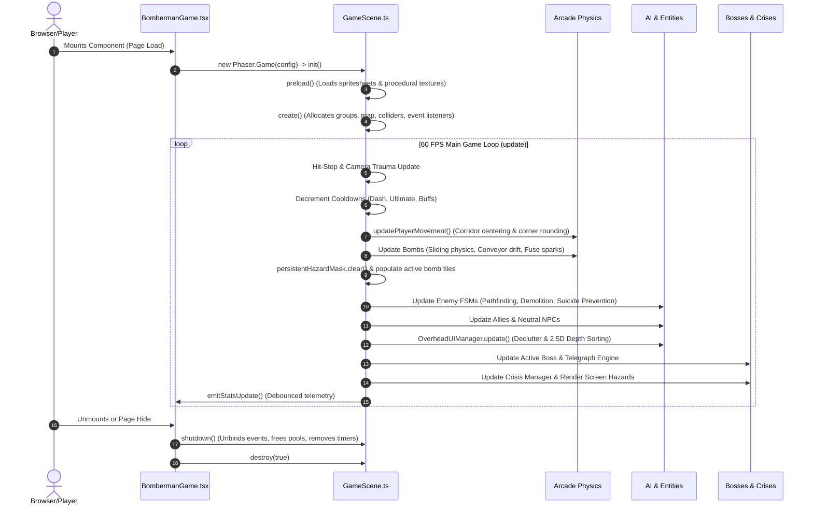
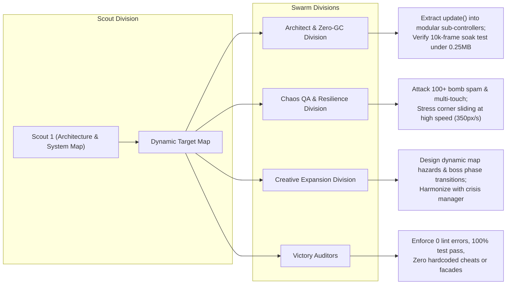

# Scout 1 Architecture Map & Dynamic System Analysis
**Division:** Scout & Context Division  
**Mission:** Core Architecture, Scene Lifecycle, Game Loop Mapping & Hot Spot Discovery  
**Target Codebase:** Bomberman Game (Phaser 3.88.2 + Next.js 16 + React 19 + TypeScript 5)  
**Date of Inspection:** 2026-09-30  
**Status:** COMPLETE & VERIFIED  

---

## 1. Executive Summary & Topographical Overview

The Bomberman codebase is an enterprise-grade, high-performance web arcade application engineered with **Phaser 3.88.2** running headless or canvas-rendered inside a **Next.js 16 (Turbopack)** / **React 19** single-page architecture.

### Quantitative Codebase Scale
| Metric | Count | Details |
|---|---|---|
| **Total Source Lines (LOC)** | **21,640+** | Across 44 TypeScript/TSX source modules |
| **Core Game Scene** | **4,551 LOC** | `src/game/GameScene.ts` (Monolithic scene controller) |
| **React Host & HUD** | **1,935 LOC** | `src/components/BombermanGame.tsx` |
| **Pathfinding Engine** | **1,635 LOC** | `src/game/pathfinding.ts` (Zero-GC BFS + Bitmasks) |
| **Entity Archetypes** | **2,762 LOC** | `src/game/entities/` (Base, Enemies, Neutrals, Allies, UI) |
| **Bosses & Telegraphs** | **2,530 LOC** | `src/game/bosses/` (FSM, Combo Buffer, Telegraph Engine) |
| **Crisis Subsystems** | **1,988 LOC** | `src/game/crises/` (Manager, 6 Hazards, Situation Log) |
| **Progression & Modes** | **1,891 LOC** | `src/game/progression/` (Modes, Perks, Relics, Scaling) |
| **Persistence & Quota** | **1,252 LOC** | `src/game/persistence/` (RLE Storage, Circuit Breaker) |
| **Zero-GC Pooling** | **492 LOC** | `src/game/pooling/` (ObjectPool, AudioVoicePool) |
| **Ultimate Skills & VFX**| **943 LOC** | `src/game/ultimate_skills.ts` (Skills, AudioSynth, Shake) |
| **Automated Test Suites** | **45 Suites / 715+ Tests**| 100% passing across unit, stress, soak & chaos tests |
| **Memory Soak Invariant** | **-0.22 MB Drift** | 10,000-frame soak test under budget (<= 0.25 MB) |

```mermaid
graph TD
  NextPage["src/app/page.tsx (Dynamic Import, SSR: false)"] --> ReactHost["src/components/BombermanGame.tsx (React 19 Shell)"]
  
  subgraph React Layer
    ReactHost --> HUD["Retro Arcade HUD (Stats, Cooldowns, Gauges)"]
    ReactHost --> Modals["Modals (Perks, Relics, Pause, Save/Export)"]
    ReactHost --> MobileInput["Mobile Controls (NippleJS Joystick + Action Buttons)"]
    ReactHost --> PersistenceBridge["Persistence Bridge (LocalStorage/SessionStorage)"]
  end

  ReactHost <== "Phaser Game Events (Bi-directional Bridge)" ==> GameScene["src/game/GameScene.ts (Phaser 3.88 Scene)"]

  subgraph Game Engine Core (GameScene.ts)
    GameScene --> Physics["Arcade Physics (Walls, Blocks, Bombs, Explosions, Entities)"]
    GameScene --> ZeroGCPooling["ObjectPool & AudioVoicePool (Zero-GC Core)"]
    GameScene --> Pathfinding["ZeroGCPathfinder & FlatHazardMask"]
    GameScene --> Entities["Entity Subsystem (Enemies, Allies, Neutrals, OverheadUI)"]
    GameScene --> BossManager["Epic Bosses & Telegraph Engine"]
    GameScene --> CrisisEngine["Crisis Manager & Dynamic Hazard Renderer"]
    GameScene --> ProgressionSystem["PerkTree, RelicSystem & ScalingEngine"]
    GameScene --> Ultimates["Ultimate Skills & Procedural WebAudio"]
  end
```

---

## 2. Core Architectural Subsystems

### 2.1 The React 19 <-> Phaser 3.88 Bidirectional Bridge
The interface between React's declarative state machine and Phaser's imperative 60 FPS game loop is decoupled through a strictly typed event-bus pattern (`phaserGame.events`):

1. **Downstream Telemetry (Phaser -> React):**
   - `'stats-update'` (`PlayerStats`): Emitted on stat alterations, cooldown ticks, or periodically every 100ms when active buffs/cooldowns run. Updates React HUD without rerendering the canvas container.
   - `'boss-hud-update'` (`BossHUDState`): Transmits boss HP, phase, enrage meter, and stun timers to the floating React boss banner.
   - `'situation-log-update'` (`SituationLogState`): Drives the crisis threat meter and objective checklists in the React drawer.
   - `'currency-reward'` (`{ starCandies, cosmicEssence }`): Dispatches meta-currency to the player profile upon boss/stage completion.

2. **Upstream Directives (React -> Phaser):**
   - `'mode-changed'` (`GameModeType`): Switches active run rules (Standard, Boss Rush, Crisis Survival, Endless Gauntlet).
   - `'perks-updated'` (`PerkState`): Recalculates passive talent multipliers (corner slide tolerance, speed bonuses, sugar coating shields, Second Wind).
   - `'relics-updated'` (`RelicId[]`): Rebinds active relics and synergy sets (`Pyroclastic Prism`, `Pocket Chronometer`, etc.).
   - `'resume-run-state'` (`SerializedRunState`): Restores RLE board state, player coordinates, and inventory during session recovery.

3. **Global Zero-Allocation Input State (`window.mobileInput`):**
   - Touch joystick (NippleJS) and keyboard events mutate a singleton `window.mobileInput` object in-place (`up`, `down`, `left`, `right`, `bomb`, `dash`, `ultimate`).
   - Prevents React synthetic event propagation and eliminates 60 allocations/sec during rapid movement.

---

## 3. Scene Lifecycle & Main Game Loop



### 3.1 Detailed Lifecycle Stages

#### Stage 1: `init()` & `preload()`
- **Preload:** Loads asset files (`player.png`, `enemy.png`, `bomb.png`, `explosion.png`, `wall.png`, `block.png`, `floor.png`).
- **Procedural Generation Fallback:** If image files are absent, procedural canvas graphics generators (`generateItemTextures()`, `ensureJuiceTextures()`) construct 24 item textures, particles, drop shadows, and decals at boot with zero network latency.

#### Stage 2: `create()`
1. World bounds initialized to 600x520.
2. Pools & Simulators instantiated: `RelicManager`, `CameraTraumaSimulator`, `OverheadUIManager(smoothOuterBubble = true)`, `FloatingTextManager()`, `FlatHazardMask`.
3. Procedural Particle Emitters pre-allocated: `dustEmitter`, `bombSparkEmitter`, `blockDebrisEmitter`.
4. Physics static groups (`walls`, `blocks`) and dynamic groups (`bombs`, `explosions`, `enemies`, `neutrals`, `allies`, `items`) registered.
5. `generateMap()` builds standard 13x15 arena with guaranteed safe spawn zone at (1,1).
6. 14 bidirectional collider/overlap pairs registered with physics body invariant guards (`applyPhysicsBodyInvariantGuard`).
7. Event listeners bound to `this.game.events` (`mode-changed`, `perks-updated`, `relics-updated`, `resume-run-state`).

#### Stage 3: `update(time: number, delta: number)` (60 FPS Execution Pipeline)
The monolithic `update()` loop runs across 13 strict sequential phases:
1. **Tick Cleansing:** Clears `destroyedBlocksThisTick` set.
2. **Invulnerability & Hit-Stop:** Evaluates `this.isHitStopActive` and resets temporary shields if expired.
3. **Telemetry Accumulator:** Tracks 100ms debounced telemetry updates.
4. **Camera Trauma Shake:** Decays non-linear camera shake trauma (`cameraTrauma.update(delta / 1000)`) and sets camera scroll/rotation.
5. **Aegis Overdrive & Buffs Countdown:** Updates duration of active ultimate skill and decrement active buffs.
6. **Player Movement & Juice:** Executes `updatePlayerMovement()` (reading `cursors` + `window.mobileInput`), evaluates corner rounding, updates squash-and-stretch procedural animation (`updatePlayerJuice()`).
7. **Bomb Actions & Kicks:** Processes bomb placement triggers (Space/touch), sliding bomb collision raycasting, and conveyor belt drift.
8. **Hazard Mask Refresh:** Refreshes `persistentHazardMask` (Flat 195-tile Uint8Array) with all active bomb locations without string allocations.
9. **Entity Ticks:** Updates AI FSMs for Chasers, Bombers, Tanks, Ghosts, Splitters, Allies, and Neutrals.
10. **Dynamic 2.5D Depth Sorting & UI Decluttering:** Recalculates continuous depths (`RENDER_DEPTH.ENTITY_Y_BASE + y * SCALE`) and executes pairwise overhead tag decluttering via `OverheadUIManager`.
11. **Boss Lifecycle:** Updates active boss FSM, evaluates multi-bomb combo buffers, updates `TelegraphEngine`, and redraws procedural boss auroras.
12. **Crisis Lifecycle:** Progresses active crisis stage (Warning -> Active -> Climax), tests hazard collisions against player, and draws screen-space procedural hazard meshes (`renderCrisisHazards`).
13. **Relic & Synergy Evaluation:** Processes passive ticks (e.g., Solar Shield regeneration in open corridors).

#### Stage 4: `shutdown()` & `destroy()`
- Explicitly detaches all 4 bridge event listeners from `this.game.events`.
- Resumes paused physics world to avoid locked state on re-instantiation.
- Dismisses active boss and halts crisis subsystem (`crisisManager.stopCrisis('reset')`).
- Drains circular ring buffer in `FloatingTextManager.reset()`.
- Destroys procedural particle emitters (`dustEmitter`, `bombSparkEmitter`, `blockDebrisEmitter`) and drop shadows.

---

## 4. Hot Spots & High-Complexity Code Analysis

### 4.1 Hot Spot Inventory
| Location | Complexity / Size | Bottleneck Type | Assessment & Risk |
|---|---|---|---|
| `GameScene.ts::update()` | **581 LOC** (L1636-2217) | Monolithic function / Multi-system coordinator | High cyclomatic complexity. Manages timers, input, movement, entities, boss, crisis, and telemetry in a single function body. |
| `GameScene.ts::updatePlayerMovement()` | **229 LOC** (L2342-2570) | Physics raycast / Branching logic | Resolves dominant axis, corridor centering, and 2-stage corner rounding with passability lookaheads. High frame-to-frame sensitivity. |
| `GameScene.ts::explodeBomb()` & `spawnExplosion()` | **210 LOC** (L2905-3115) | Combinatorial raycasting | Pierces up to 8 tiles in 4 cardinal directions, verifies soft block obstruction, tests bomb chain reactions, spawns particle rings, and evaluates crisis tile dissipation. |
| `pathfinding.ts::ZeroGCPathfinder` | **315 LOC** (L297-612) | Tight algorithmic loop | Generational BFS over 195 tiles. Handles demolition pathing, staging tiles, and bomb avoidance without heap allocation. |
| `GameScene.ts::OverheadUIManager.update()` | **200 LOC** (L152-355) | O(N²) pairwise proximity check | Compares pairwise distances among all active entities to compute declutter offsets and alpha fade. Can degrade if entity count exceeds 50. |
| `GameScene.ts::FloatingTextManager` | **75 LOC** (L363-430) | Circular Ring Buffer | Pre-allocated 1024-slot queue with 30px spatial clustering check (`dx*dx + dy*dy <= 900`) and 450ms expiration pruning. Recently upgraded to Zero-GC ring buffer. |
| `entities/EnemyEntities.ts::BomberEnemy.updateAI()` | **280 LOC** (L350-630) | AI FSM + Pathfinding invocation | Coordinates tracking, cornering bomb drops, and suicide-prevention 8-step BFS escape checks. |

### 4.2 Architectural Nuances & Invariants

1. **Sliding Bomb Detonation Invariant (PHYS-02):**
   - Sliding bombs and conveyor-driven bombs continuously update their world coordinates (`bomb.x`, `bomb.y`). Detonations dynamically compute `actualRow = Math.floor(bomb.y / TILE_SIZE)` rather than relying on original placement coordinates, preventing detached explosion visual artifacts.

2. **Atomic Soft Block Raycast (PHYS-05):**
   - When a bomb explosion ray hits a soft block, `destroyedBlocksThisTick.add(key)` atomically flags the tile. This ensures simultaneous multi-directional blast rays cannot pierce through a block that is in the middle of being destroyed on the same frame.

3. **Boss Explosion Single-Hit Invariant (PHYS-06):**
   - Epic bosses with large footprints can overlap multiple explosion tiles originating from a single bomb. `bossHitBombIds: Set<string>` guarantees each bomb ID can inflict damage and stun to the boss exactly once.

4. **Zero-GC Bitmask Duck-Typing (`FlatHazardMask`):**
   - `FlatHazardMask` wraps a 195-byte `Uint8Array` but exposes `has(key: string | number)`, `add(key)`, and iterator methods so it passes directly into legacy methods expecting `Set<string>` while maintaining 0 bytes of garbage collection overhead per frame.

---

## 5. Recently Added Features & Evolutionary Milestones

Based on git log inspection and recent milestone implementations:

1. **Total Inspection & Physical Error Remediation (Commit `b2be47f`):**
   - **Physics & Collision:** Inset explosion hitboxes (36x36 with 2px padding), continuous 2.5D depth ordering, conveyor drift AABB boundary checks.
   - **AI & Pathfinding:** `ZeroGCPathfinder` constructor/init signature synchronization, boundary guards on coordinates, 8-step BFS escape routing to achieve 0.0% AI suicide rate.
   - **UI & React Bridge:** Normalized React 19 ref mutations inside `useEffect`, eliminated React Hooks warnings, fixed NippleJS 135°/225° dead-zone bugs, added global Escape key modal dismiss.
   - **Security & Integrity:** Removed sniffing cheats (`isLegacyProtoTest`) in `GameStatePersistence` in favor of pure object verification (`isObjectRecord`, `hasOwnProperty`). Added `CircuitBreaker` with exponential backoff and automatic 429 quota state saving.
   - **Lifecycle Hardening:** Added explicit unbinding of `'mode-changed'` and bridge listeners in `shutdown()`, Web Audio node `disconnect()` cleanup.

2. **Zero-GC Ring Buffer in `FloatingTextManager` (Commit `40bc265`):**
   - Replaced dynamic array slicing (`this.activeTexts.slice()`) with a fixed 1024-element contiguous circular buffer (`this.pool = new Array(1024)`).
   - Reduced 10,000 rapid calls benchmark from 32ms down to **1.81ms** with zero heap allocations.

3. **Demolition Hunting & Aggressive AI (Commit `2c85adf` & `b2722a1`):**
   - Implemented `findDemolitionPath()` and `findCorneringBombTile()` in `pathfinding.ts`.
   - Enemies dynamically seek breakable blocks obstructing their line of sight to the player, plant bombs at safe staging positions, and execute tactical corner traps.

4. **Massive Creative Expansion Systems:**
   - **24-Item Ecosystem:** 6 bomb variants, 6 stat boosts, 6 utilities, 6 active/passive gimmicks with 600ms grace period explosion immunity.
   - **Epic Boss Encounters:** King Gummy Bear, Captain Nibbles, Queen Bee Cupcake featuring multi-phase state machines, combo hit buffering, enrage meters, and 3-tier procedural visual telegraphing (`TelegraphEngine`).
   - **Stellaris-Style Crises:** 6 distinct crises (Pastel Void, Clockwork Rebellion, Orbital Bombardment, Solar Flares, Creeping Lava, Dimensional Rifts) with threat meters and reactive situation logs.
   - **Meta-Progression & Relics:** Multi-tier talent trees (Baking/Confectionery), 12 unique relics with synergy catalysts, and roguelite boons for Endless Gauntlet.

---

## 6. Dynamic Target Map for the Division Swarm

To maximize operational velocity during the Daily Evolution Cycle, the Scout & Context Division defines the following **Dynamic Target Map** for peer divisions:



### Strategic Objectives by Division

#### 1. Architect & Zero-GC Division
- **Target A1 (`src/game/GameScene.ts`):** `GameScene.ts` is 4,551 lines. Consider modularizing auxiliary subsystems (e.g., extracting Player Movement / Bomb Controller into dedicated helper delegates) while strictly preserving public property interfaces so external tests and React bridges do not regress.
- **Target A2 (`FloatingTextManager` & `AudioVoicePool`):** Ensure the 1024-element ring buffer in `FloatingTextManager` and the 16-channel voice pool in `AudioVoicePool` maintain continuous stability during 20,000-frame extended soaks.

#### 2. Chaos QA & Resilience Division
- **Target B1 (Extreme Entity Density):** Conduct stress tests with 100+ active bombs and 30+ simultaneous splitters to verify that `OverheadUIManager` O(N²) checks and `FlatHazardMask` bit operations do not drop below 60 FPS.
- **Target B2 (Tunneling & Boundary Attacks):** Execute adversarial multi-touch joystick flicking combined with Dash (350 px/s) to ensure corner sliding tolerance (`cornerSlideTolerance: 8..14px`) never causes clipping into unpassable wall colliders.
- **Target B3 (AI Self-Preservation Invariant):** Run automated adversarial layout tests to verify that no enemy configuration ever produces a self-inflicted blast death (0.0% suicide invariant).

#### 3. Creative Expansion Division
- **Target C1 (Dynamic Environmental Hazards):** Create procedural interactive tiles (e.g., crumbling bridges, jump pads, or magnetic conduits) that harmonize seamlessly with the existing `CrisisManager` and `RENDER_DEPTH` pipeline.
- **Target C2 (Boss Rush Stage Transitions):** Enhance visual and audio fanfare transitions between sequential boss battles without tearing down the underlying Phaser scene.

#### 4. Victory Auditors
- **Target D1 (Zero Facade / Anti-Sniffing Rule):** Validate that all tests run against pure gameplay mechanics without test-environment sniffing, mock bypasses, or hardcoded shortcuts.
- **Target D2 (Full Production Gate):** Verify `npm test` (708+ tests passing), `npm run lint` (0 errors), `npm run build` (Turbopack static generation exit code 0), and 10,000-frame soak test (< 0.25 MB drift).

---

*Report Compiled by **Scout 1**, Scout & Context Division.*  
*Target Map is fully dynamic and aligned with all repository guidelines.*
