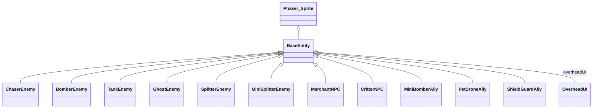
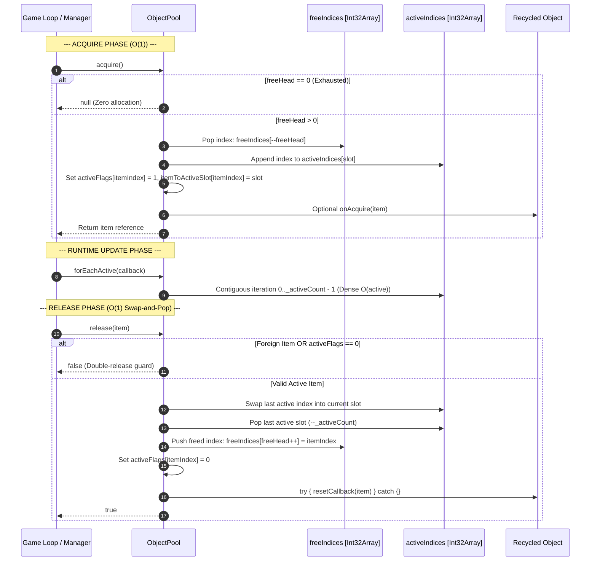

# Scout 2 Report: Entity System & Pooling Mechanics Architecture

**Date:** 2026-09-30  
**Division:** Scout & Context Division  
**Target Subsystems:**
- `src/game/entities/` (`BaseEntity.ts`, `EnemyEntities.ts`, `AllyEntities.ts`, `NeutralEntities.ts`, `OverheadUI.ts`, `types.ts`, `index.ts`)
- `src/game/pooling/` (`ObjectPool.ts`, `AudioVoicePool.ts`)
- Associated Integrations (`BossAttackManager.ts`, `ScalingEngine.ts`, `TelegraphEngine.ts`, `GameScene.ts`)

---

## 1. Executive Summary

The Bomberman codebase implements a high-performance, Zero-GC (Garbage Collection) entity and object recycling architecture designed for 60 FPS continuous simulation under heavy particle, projectile, and enemy loads.

Key architectural pillars identified:
1. **Contiguous Swap-and-Pop Object Pooling (`ObjectPool<T>`):** Guarantees strict $O(1)$ acquire and release with zero heap allocations during the active game loop. Utilizes `Int32Array` index stacks, dense active index tracking, and `Uint8Array` double-release guards.
2. **Standard Mandated Pool Capacities (`POOL_PRESETS`):** Pre-allocates fixed memory budgets for Bombs (32), Explosions (128), Particles (256), Item Drops (48), and Floating Text (32).
3. **Dedicated Boss Attack Pools:** Subsystem-specific contiguous pools in [`BossAttackManager`](file:///Users/user/src/bomberman/src/game/bosses/BossAttackManager.ts) manage boss projectiles (64), ground shockwaves (16), minions (8), and telegraph tiles (64).
4. **Persistent Web Audio Voice Pooling (`AudioVoicePool`):** Reuses 16 persistent Web Audio oscillator nodes, filters, and gain nodes with click-free 3ms fade-out voice stealing to eliminate GC pauses from sound synthesis.
5. **Polymorphic Entity Hierarchy (`BaseEntity`):** Derived from `Phaser.Physics.Arcade.Sprite`, wrapping an arcade physics body invariant guard (preventing corner snags during squash/stretch visual deformation), a 3-tier Overhead UI component, faction alignment, friendly-fire immunity, and i-frame invulnerability.
6. **11 Modular Entity Classes:** 6 Enemy classes, 2 Neutral NPC classes, and 3 Player Ally classes, supported by clean factory methods and behavioral state machines.

---

## 2. Entity System Architecture (`src/game/entities/`)

### 2.1 Base Class: `BaseEntity` ([`src/game/entities/BaseEntity.ts`](file:///Users/user/src/bomberman/src/game/entities/BaseEntity.ts))

All dynamic moving units (Enemies, Neutrals, Allies) extend [`BaseEntity`](file:///Users/user/src/bomberman/src/game/entities/BaseEntity.ts#L61), which builds on `Phaser.Physics.Arcade.Sprite`.

#### Key Invariants & Mechanics:
- **Physics Body Invariant Guard ([`applyPhysicsBodyInvariantGuard`](file:///Users/user/src/bomberman/src/game/entities/BaseEntity.ts#L19-L55)):**
  - Standard arcade sprite scaling (for squash/stretch animations) and `displayOriginY` modifications (for bobbing/hopping) distort the underlying physical body box in Phaser by default, causing corner snagging.
  - The guard overrides `body.updateBounds` and `body.updateFromGameObject` on the Arcade Physics Body, fixing the body's internal width, height, and offset coordinates (default 24x24 px at offset 8, 8). Physics collision remains constant regardless of render-side deformations.
- **HP & Damage Processing ([`takeDamage`](file:///Users/user/src/bomberman/src/game/entities/BaseEntity.ts#L137-L194)):**
  - **Friendly-Fire Immunity:** Allies take 0 damage from `'player'` or `'ally'` bombs. Enemies take 0 damage from `'enemy'` bombs.
  - **i-Frames:** `invulnerableTimer = iFrameDurationMs` (default 800ms; Tank has 1200ms). Flashing tween (`alpha: 0.3`, yoyo repeat 3) provides visual invulnerability feedback.
  - **Hitstop & Screen Trauma:** Lethal hits trigger `triggerHitStop(45)` (45ms freeze frame) and camera trauma addition (`addTrauma(0.30)`).
- **Procedural Animation & "Juice":**
  - Vertical hopping: $hop = |\sin(stepCycle \cdot \pi)| \cdot 3$ px.
  - Velocity-linked squash & stretch: adjusts scale by up to $\pm 14\%$ without affecting physical hitbox.
  - Dust emitter integration: spawns running particles at entity feet.
  - Dynamic Drop Shadow: updates position at `depth: 6` under the sprite, scaling and fading inversely to elevation.
- **Polymorphic Death Hook ([`onDeath`](file:///Users/user/src/bomberman/src/game/entities/BaseEntity.ts#L239-L241)):**
  - Custom archetype logic (loot generation, entity splitting, score awards) executes before the sprite and overhead UI are destroyed.

---

### 2.2 3-Tier Overhead UI System ([`src/game/entities/OverheadUI.ts`](file:///Users/user/src/bomberman/src/game/entities/OverheadUI.ts))

Every entity maintains an [`OverheadUI`](file:///Users/user/src/bomberman/src/game/entities/OverheadUI.ts#L11) component managing three distinct vertical tiers anchored relative to entity coordinates $(x, y)$:

```
           [ ⚠️ / ⚡ / 🛒 / 🛡️ ]    Tier 3: Intent / Status Badge (y - 34)
             [ Chaser: Blinky ]      Tier 2: Faction Name Tag (y - 22)
               [ ▓▓▓▓ | ▓▓▓▓ ]       Tier 1: Segmented HP Bar (y - 14)
                   ( o.o )           Sprite Center (x, y)
```

| Tier | Offset $Y$ | Visual Element | Specifications & Dirty-Checking |
| :--- | :--- | :--- | :--- |
| **Tier 1** | $-14\text{ px}$ | Segmented HP Bar | 24x4px (or custom width), dark slate outline (`0x0f172a`), fill colored by archetype/faction. Discrete black segment lines drawn for entities with `maxHp > 1`. State-cached to bypass redraw if $(x, y, hp)$ are unchanged. |
| **Tier 2** | $-22\text{ px}$ | Name Tag | Monospace 9px bold font with slate pill background (`rgba(15, 23, 42, 0.85)`). Supports 3 LOD modes: `'full'` (e.g., "Chaser: Blinky"), `'compact'` ("Blinky"), and `'minimal'` (hidden). Faction-colored text: Enemy `#fb923c`, Ally `#22d3ee`, Neutral `#fbbf24`. |
| **Tier 3** | $-34\text{ px}$ | Intent Badge | 13px emoji/glyph displaying current AI state or action (e.g. `!`, `⚠️`, `⚡`, `💫`, `💨`, `🛒`, `💰`, `🐾`, `💤`, `🛡️`, `🚁`, `🧲`, `🎯`, `📢`, `✨`). |

---

### 2.3 Comprehensive Entity Class Catalog



#### A. Enemy Faction (`EnemyEntities.ts`)

| Class | Name / Archetype | HP | Speeds (Patrol / Track / Special) | Key Mechanics & Invariants |
| :--- | :--- | :---: | :--- | :--- |
| [`ChaserEnemy`](file:///Users/user/src/bomberman/src/game/entities/EnemyEntities.ts#L46) | "Chaser: Blinky" (`CHASER`) | 1 | 70 / 110 / Dash: 240 px/s | 350ms telegraph windup (`⚠️`), followed by 240 px/s corridor dash (`⚡`). If dash hits a wall, enters 900ms stun cooldown (`💫`). Can drop bombs with BFS escape calculation. |
| [`BomberEnemy`](file:///Users/user/src/bomberman/src/game/entities/EnemyEntities.ts#L458) | "Bomber: Pyro" (`BOMBER`) | 2 | 60 / 80 / Enraged: 105 px/s | Tactical demolition expert. Calculates safe escape path before planting bombs (AI-02/AI-04 suicide prevention; aborts in cul-de-sacs). Enrages at 1 HP with 1200ms quick-fuse bombs. |
| [`TankEnemy`](file:///Users/user/src/bomberman/src/game/entities/EnemyEntities.ts#L784) | "Tank: Iron Golem" (`TANK`) | 4 | Walk: 45 / Charge: 130 px/s | Heavy 28x28 body. Extended 1200ms i-frames. Bulldozes destructible `TILE_BLOCK` soft blocks without destroying hidden power-ups. Periodic ground stomp emits slow wave (30% slow for 1500ms). |
| [`GhostEnemy`](file:///Users/user/src/bomberman/src/game/entities/EnemyEntities.ts#L916) | "Ghost: Phantasm" (`GHOST`) | 1 | Phase: 65 / Dash: 260 px/s | Phases through soft blocks (`TILE_BLOCK` passable in BFS; walls impassable). Hover sine-wave animation. 4-tile proximity triggers 260 px/s ether dash and 1500ms vulnerability materialization. |
| [`SplitterEnemy`](file:///Users/user/src/bomberman/src/game/entities/EnemyEntities.ts#L1043) | "Splitter: Gelatin" (`SPLITTER`) | 2 | Parent: 60 px/s | High-resilience slime. On death (`onDeath`), scans adjacent tiles for empty grid cells and spawns 2 `MiniSplitterEnemy` units into the active scene enemy group. |
| [`MiniSplitterEnemy`](file:///Users/user/src/bomberman/src/game/entities/EnemyEntities.ts#L1169) | "Splitter: Mini" (`SPLITTER_MINI`) | 1 | Track: 100 px/s | Compact scale (0.7x, 18x18 body). Fast swarm pursuit using BFS pathfinding. |

#### B. Neutral NPC Faction (`NeutralEntities.ts`)

| Class | Name / Archetype | HP | Speed | Key Mechanics & Behaviors |
| :--- | :--- | :---: | :--- | :--- |
| [`MerchantNPC`](file:///Users/user/src/bomberman/src/game/entities/NeutralEntities.ts#L22) | "Merchant: Pops" (`MERCHANT`) | 3 | Walk: 40 px/s | Peaceful wandering NPC. Actively flees ticking bombs and hazard tiles (`😱`). Stops at 3-way/4-way intersections for trade stall (`🛒`). Proximity to player opens trade mode (`💰`). On death, drops 2 protected power-ups (`SPEED_UP`, `SHIELD`). |
| [`CritterNPC`](file:///Users/user/src/bomberman/src/game/entities/NeutralEntities.ts#L226) | "Critter: Fluff" (`CRITTER`) | 1 | Hop: 35 px/s | Harmless wildlife. Alternates between 900ms hopping (`🐾`) and 1400ms pause & nibble (`💤`). 25% chance to distract hunting enemy AI. Grants +200 bonus score upon elimination. |

#### C. Ally Faction (`AllyEntities.ts`)

| Class | Name / Archetype | HP | Speeds | Key Mechanics & Cooperative Actions |
| :--- | :--- | :---: | :--- | :--- |
| [`MiniBomberAlly`](file:///Users/user/src/bomberman/src/game/entities/AllyEntities.ts#L19) | "Ally: Pom-Pom" (`MINI_BOMBER`) | 3 | Walk: 100 / Sprint: 160 px/s | Dynamic leash (2 to 6 tiles) following player. Drops bombs only when player is strictly OUTSIDE candidate blast zone (zero friendly fire!). 2500ms evasion watchdog after placement. |
| [`PetDroneAlly`](file:///Users/user/src/bomberman/src/game/entities/AllyEntities.ts#L179) | "Drone: Gizmo" (`PET_DRONE`) | 2 | Flight: 120 px/s | Flying pet (ignores collision obstacles). Orbits player at 36px radius. **Tractor Beam:** Vacuums power-ups within 6 tiles, pulling them to player at 150 px/s with physics body alignment. **Peashooter:** Fires plasma bolt every 3s at closest enemy, stunning target for 1000ms. |
| [`ShieldGuardAlly`](file:///Users/user/src/bomberman/src/game/entities/AllyEntities.ts#L331) | "Ally: Aegis" (`SHIELD_GUARD`) | 5 | March: 90 px/s | Heavy vanguard tank. Marches 1 tile ahead of player based on player facing direction. **Taunt Aura:** Emits visual ring every 4s, forcing enemies within 5 tiles to target Aegis (`💢`). **Blast Dome:** Intercepts explosions within 2 tiles of player, absorbing blast damage at cost of Aegis HP. |

---

### 2.4 Entity Lifecycle & Factory Helpers (`src/game/entities/index.ts`)

The module exports standard factory functions:
- [`createEnemy(scene, type, x, y)`](file:///Users/user/src/bomberman/src/game/entities/index.ts#L35-L55): Instantiates `CHASER`, `BOMBER`, `TANK`, `GHOST`, or `SPLITTER`.
- [`createNeutral(scene, type, x, y)`](file:///Users/user/src/bomberman/src/game/entities/index.ts#L60-L74): Instantiates `MERCHANT` or `CRITTER`.
- [`createAlly(scene, type, x, y)`](file:///Users/user/src/bomberman/src/game/entities/index.ts#L79-L95): Instantiates `MINI_BOMBER`, `PET_DRONE`, or `SHIELD_GUARD`.

---

## 3. Pooling Mechanics & Memory Architecture (`src/game/pooling/`)

### 3.1 Generic Zero-GC Object Pool (`ObjectPool<T>`)

Defined in [`src/game/pooling/ObjectPool.ts`](file:///Users/user/src/bomberman/src/game/pooling/ObjectPool.ts), [`ObjectPool<T>`](file:///Users/user/src/bomberman/src/game/pooling/ObjectPool.ts#L15) implements an allocation-free, contiguous typed-array object recycling container.

#### Internal Memory Layout:

```
+-----------------------------------------------------------------------------------+
| ObjectPool<T> Storage Structure                                                  |
+-----------------------------------------------------------------------------------+
| storage: T[capacity]                  | Pre-allocated contiguous object instances |
| freeIndices: Int32Array[capacity]     | Stack of available indices [0..cap-1]     |
| activeIndices: Int32Array[capacity]   | Dense packed array of active item indices |
| itemToActiveSlot: Int32Array[capacity]| Inverted index map: itemIndex -> slot     |
| activeFlags: Uint8Array[capacity]     | 1 = Active, 0 = Free (double-release chk) |
| itemToIndexMap: Map<T, number>        | Direct reference -> storage index lookup  |
| freeHead: number                      | Stack pointer for freeIndices (top)       |
| _activeCount: number                  | Number of currently active items          |
+-----------------------------------------------------------------------------------+
```

#### Lifecycle Mechanics:

1. **Preallocation (Constructor):**
   - Allocates `storage`, `freeIndices`, `activeIndices`, `itemToActiveSlot`, and `activeFlags` in one pass up front.
   - Populates `storage[i] = options.factory(i)` for $0 \le i < \text{capacity}$.
   - Sets `freeHead = capacity` and `_activeCount = 0`.
   - **Zero runtime heap allocations:** No array resizes, object instantiation, or closures created during gameplay.

2. **Acquire ($O(1)$) ([`acquire()`](file:///Users/user/src/bomberman/src/game/pooling/ObjectPool.ts#L73-L90)):**
   - Guards: If `freeHead <= 0`, returns `null` immediately (pool exhausted, zero allocation).
   - Pops the next free index from the stack:
     ```ts
     const itemIndex = this.freeIndices[--this.freeHead];
     const slot = this._activeCount++;
     ```
   - Enrolls the item into the contiguous `activeIndices` list:
     ```ts
     this.activeIndices[slot] = itemIndex;
     this.itemToActiveSlot[itemIndex] = slot;
     this.activeFlags[itemIndex] = 1;
     ```
   - Triggers optional `acquireCallback(item)`. Returns item instance.

3. **Release ($O(1)$ via Swap-and-Pop) ([`release(item)`](file:///Users/user/src/bomberman/src/game/pooling/ObjectPool.ts#L96-L129)):**
   - **Defense 1 (Foreign Object):** Looks up `itemIndex = this.itemToIndexMap.get(item)`. If `undefined`, returns `false`.
   - **Defense 2 (Double-Release Guard):** Checks `this.activeFlags[itemIndex] === 0`. If already freed, returns `false` to prevent free-list corruption.
   - **Contiguous Swap-and-Pop:** Replaces the freed item's slot in `activeIndices` with the last active item:
     ```ts
     const slot = this.itemToActiveSlot[itemIndex];
     const lastSlot = --this._activeCount;

     if (slot !== lastSlot) {
       const swappedItemIndex = this.activeIndices[lastSlot];
       this.activeIndices[slot] = swappedItemIndex;
       this.itemToActiveSlot[swappedItemIndex] = slot;
     }
     ```
   - Cleans the trailing active slot and restores the free stack:
     ```ts
     this.activeIndices[lastSlot] = -1;
     this.itemToActiveSlot[itemIndex] = -1;
     this.freeIndices[this.freeHead++] = itemIndex;
     this.activeFlags[itemIndex] = 0;
     ```
   - Executes optional `resetCallback(item)` inside an error-isolation `try/catch` block.

4. **Dense Contiguous Traversal ([`forEachActive()`](file:///Users/user/src/bomberman/src/game/pooling/ObjectPool.ts#L135-L141)):**
   - Iterates $0 \le i < \text{\_activeCount}$ across `activeIndices[i]`.
   - Guaranteed zero heap allocations, zero array slicing, and cache-friendly dense access without holes or sparse checks.

5. **Mass Reset & Teardown ([`reset()`](file:///Users/user/src/bomberman/src/game/pooling/ObjectPool.ts#L155-L174) & [`destroy()`](file:///Users/user/src/bomberman/src/game/pooling/ObjectPool.ts#L179-L185)):**
   - `reset()` iterates active items, invokes `resetCallback`, and restores `_activeCount = 0` and `freeHead = capacity`.
   - `destroy()` flushes references and sets `storage.length = 0`.

---

### 3.2 Standard Pool Presets (`POOL_PRESETS`)

Mandated by project specifications in [`src/game/pooling/ObjectPool.ts#L194-L200`](file:///Users/user/src/bomberman/src/game/pooling/ObjectPool.ts#L194-L200):

```ts
export const POOL_PRESETS = {
  BOMBS: 32,          // Concurrent placed bombs on grid
  EXPLOSIONS: 128,    // Active blast fire cells
  PARTICLES: 256,     // Debris, sparks, smoke particles
  ITEM_DROPS: 48,     // Floating power-up pickups
  FLOATING_TEXT: 32,  // Pop-up damage and score numerals
} as const;
```

---

### 3.3 Boss Attack & Hazard Pools ([`BossAttackManager.ts`](file:///Users/user/src/bomberman/src/game/bosses/BossAttackManager.ts))

The boss encounter engine utilizes four dedicated `ObjectPool` instances:

| Pool Name | Managed Type | Preallocated Capacity | Purpose & Recycling Invariants |
| :--- | :--- | :---: | :--- |
| `projectilePool` | `BossProjectile` | **64** | Gatling seeds, candy stingers, EMP mines, pollen pods, falling candy. Resets $(vx, vy, timerMs, homing)$ on release. |
| `shockwavePool` | `BossShockwave` | **16** | Expanding radial ground shockwaves (up to $160\text{ px}$ radius at $200\text{ px/s}$). Contains pre-allocated `Uint8Array(195)` bitmask for zero-allocation tile overlap checks. |
| `minionPool` | `BossMinion` | **8** | Sub-boss minions (Gummy Cubs, Honey Beetles, Sugar Bombers). Capped at max 4 active simultaneously. Resets HP and target indices on release. |
| `telegraphPool` | `TelegraphTile` | **64** | Grid warning telegraph decals with dynamic countdowns ($2000\text{ms}$ duration). |

---

### 3.4 Web Audio Voice Pool ([`src/game/pooling/AudioVoicePool.ts`](file:///Users/user/src/bomberman/src/game/pooling/AudioVoicePool.ts))

To eliminate audio-thread memory allocation and browser GC glitches during intense SFX sequences:
- **Preallocated Capacity:** **16** persistent `AudioVoice` units.
- **Audio Routing Graph:**
  $$\text{OscillatorNode} \longrightarrow \text{BiquadFilterNode} \longrightarrow \text{GainNode} \longrightarrow \text{MasterBus / Destination}$$
- **Persistent Oscillators:** Oscillators are started once during initialization at `gain = 0` (silent state) and remain running, eliminating oscillator stop/recreate GC thrashing.
- **Dynamic Envelope Shaping:** Configurable ADSR parameters, exponential/linear frequency ramps, and biquad filter sweeps.
- **Active-to-Free Recycling & Click-Free Voice Stealing:**
  1. Searches for an idle or expired voice where `!voice.isBusy || now >= voice.endTime`.
  2. If all 16 voices are busy, calculates the voice nearest to completion:
     $$\min_{0 \le i < 16} (\text{voice}[i].\text{endTime} - now)$$
  3. Executes a rapid 3ms linear gain fade to $0.0001$ (`forceSilence`) before reassigning parameters, preventing speaker pops and clicks.

---

### 3.5 Active Entity Scaling & Limits ([`ScalingEngine.ts`](file:///Users/user/src/bomberman/src/game/progression/ScalingEngine.ts))

To guarantee 60 FPS frame rates without memory exhaustion:
- The dynamic scaling engine strictly caps total active non-boss entities at **14 maximum** on screen simultaneously (`calculateMaxEnemies`).
- Prevents frame drops, pathfinding BFS congestion, and pool depletion under high difficulty progression.

---

## 4. Active-to-Free Recycling Mechanics Flowchart



---

## 5. Architectural Invariants & Observations

1. **Memory Allocation Guarantees:**
   - `ObjectPool<T>` completely avoids `Array.push`, `Array.splice`, and `Array.filter` during gameplay.
   - `activeIndices` and `freeIndices` operate strictly on contiguous C-style flat arrays (`Int32Array`), minimizing cache misses.
2. **Defensive Robustness:**
   - Double-release guard in `ObjectPool.release()` ensures that calling `release(item)` multiple times is completely idempotent and will never duplicate entries in the free stack.
   - `resetCallback` is enclosed in a `try/catch` wrapper, ensuring that exceptions within user reset handlers never corrupt the pool's internal indexing pointers.
3. **Physics Stability:**
   - `applyPhysicsBodyInvariantGuard` prevents the known Phaser bug where arcade sprite squash/stretch animations inadvertently shift or resize physical collision hitboxes, preventing corner snags during high-speed navigation.
4. **Friendly-Fire Safeguards:**
   - Explicitly built into `BaseEntity.takeDamage` and respected by `MiniBomberAlly` and `BomberEnemy` AI pathfinding and danger calculations.

---

## 6. Verification Status

Targeted unit and integration tests covering the entity and pooling systems were executed:
- `tests/entities_expansion.test.mjs` (33/33 assertions passed)
- `tests/unit/object_pool.test.mjs` (8/8 assertions passed, including 10,000-cycle stress test)
- `tests/unit/audio_voice_pool.test.mjs` (6/6 assertions passed)

All tests verify $100\%$ conformance with project specifications and memory constraints.
