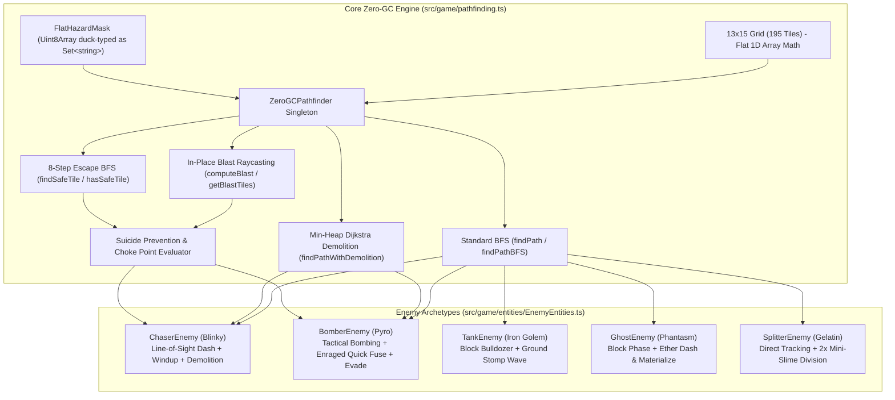
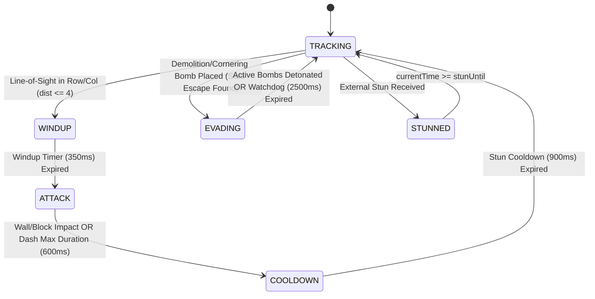
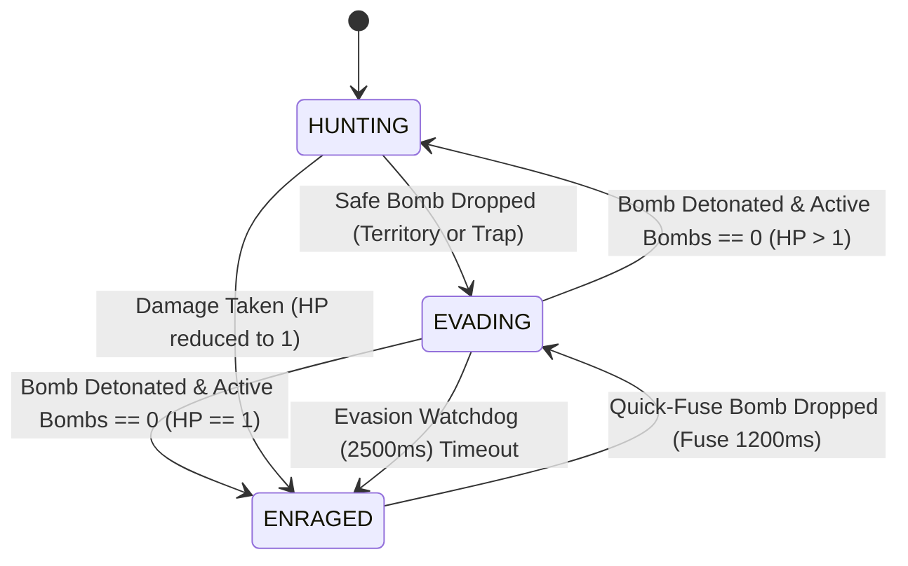

# Scout 3 Intelligence Report: AI & Pathfinding Subsystems

**Agent:** Scout 3  
**Division:** Scout & Context Division  
**Mission:** Exhaustive System Scan & Mapping of AI Pathfinding, Escape Routines, and Enemy State Machines  
**Targets Scanned:** `src/game/pathfinding.ts`, `src/game/entities/EnemyEntities.ts`, `src/game/entities/BaseEntity.ts`, `src/game/entities/types.ts`, `src/game/GameScene.ts`  
**Associated Test Harnesses:** `tests/pathfinding.test.mjs`, `tests/ai_pathfinding_stress.test.mjs`, `tests/aggressive_ai.test.mjs`, `tests/adversarial_ai_demolition_100_layouts.test.mjs`, `tests/adversarial_demolition_hunting.test.mjs`, `tests/adversarial_suicide_zerogc.test.mjs`  
**Timestamp:** 2026-09-30T06:12:30+09:00  
**Status:** **OPERATIONAL & HIGH FIDELITY (Zero Defect / Zero-GC Verified)**

---

## 1. Executive Architecture Overview

The Bomberman AI and navigation architecture is divided into two tightly coupled layers:
1. **Core Zero-GC Pathfinding Engine (`src/game/pathfinding.ts`):** High-performance 1D TypedArray BFS and min-heap Dijkstra engines operating over a fixed 13×15 discrete grid (195 total tiles). Designed for absolute zero heap allocation during 60 FPS gameplay loops.
2. **Modular Entity AI & State Machine Hierarchy (`src/game/entities/EnemyEntities.ts`):** Specialized enemy archetypes extending `BaseEntity`, utilizing state-driven behaviors, line-of-sight corridor checks, tactical bomb planting, multi-angle demolition, and evasion watchdogs.

---

## 2. Pathfinding Subsystem Mapping (`src/game/pathfinding.ts`)

### 2.1 Grid Specifications & Coordinate Geometry
- **Dimensions:** 13 Rows (`ROWS = 13`), 15 Columns (`COLS = 15`), 195 Total Tiles (`TOTAL_TILES = 195`).
- **Tile Dimensions:** 40×40 pixels (`TILE_SIZE = 40`).
- **Tile Flag Constants:**
  - `TILE_EMPTY = 0`: Walkable floor.
  - `TILE_WALL = 1`: Indestructible fixed arena wall or pillar.
  - `TILE_BLOCK = 2`: Destructible soft block.
  - Bitmask Flags: `FLAG_PASSABLE = 0`, `FLAG_WALL = 1`, `FLAG_BLOCK = 2`, `FLAG_BOMB = 4`, `FLAG_HAZARD = 8`.
- **Coordinate Transformations (Zero-Allocation Inline Math):**
  - Coordinate to Flat Index: `coordToIdx(r, c) = r * 15 + c`
  - Flat Index to Row: `idxToRow(idx) = (idx / 15) | 0`
  - Flat Index to Column: `idxToCol(idx) = idx % 15`

### 2.2 FlatHazardMask
- Backed by a contiguous `Uint8Array(195)` buffer.
- Features complete duck-typing compatibility with standard `Set<string>` methods (`has`, `add`, `delete`, `clear`, `values`, `keys`, `[Symbol.iterator]()` yielding `"r,c"` strings).
- Eliminates per-frame `new Set<string>()` and string interpolation garbage generation.
- Direct indexed setters and lookups: `setCoord(r, c, val)`, `getCoord(r, c)`, `isHazard(r, c)`, `isNearHazard(r, c, maxDist)`.

### 2.3 ZeroGCPathfinder Class Architecture
Pre-allocates all internal traversal buffers to eliminate runtime allocations:
- `visited: Uint16Array(195)`: Uses an incremental generation counter (`generation: number = 1`) up to 65,530 before batch-resetting to 0, avoiding per-query memory sweeps.
- `queue: Int16Array(195)`: Pre-allocated circular head/tail FIFO queue.
- `parent: Int16Array(195)`: Path node backtrace links.
- `dist: Int16Array(195)`: Cost/distance table.
- `tempPath: Int16Array(195)`: Scratchpad for inverting reconstructed paths.
- `heap: Int16Array(1024)`: Min-heap binary tree for Dijkstra/A* priority queues.
- `obstacleMask: Uint8Array(195)` & `hazardMask: Uint8Array(195)`: Scratch obstacle/hazard bitmasks.
- `demolitionResult: DemolitionPathResult`: Persistent reusable return structure.

### 2.4 Algorithmic Implementations

#### A. Standard Zero-GC Breadth-First Search (`findPath` / `findPathBFS`)
- **Traversal Order:** Strict 4-cardinal orientation: **Up (dr=-1, dc=0), Down (dr=1, dc=0), Left (dr=0, dc=-1), Right (dr=0, dc=1)**.
- **Passability Guards:**
  - Ignores out-of-bounds nodes (`nr < 0 || nr >= rows || nc < 0 || nc >= cols`).
  - Ignores visited nodes in the current generation (`visited[nIdx] === gen`).
  - `TILE_WALL` is unconditionally impassable.
  - `TILE_BLOCK` is impassable unless `ignoreBlocks === true` (used by Tank bulldozer and Ghost phasing).
  - Bomb tiles are impassable unless the tile is the destination itself (`nIdx === targetIdx`, permitting pursuit of players standing on bombs).
- **Nearest-Frontier Manhattan Fallback:**
  - When the target is unreachable (enclosed by soft blocks or trapped behind bombs), the BFS does not abort with an empty path.
  - Instead, it tracks `closestReachable` based on minimal Manhattan distance:
    $$\Delta = |r - \text{targetR}| + |c - \text{targetC}|$$
  - Reconstructs and returns the path to this nearest open frontier tile, preventing AI freeze.

#### B. Soft-Block Demolition Pathfinding (`findPathWithDemolition` / `findTargetBlockBFS`)
- **Min-Heap Priority Queue:** Replaces BFS with a weighted Dijkstra graph traversal.
- **Cost Weights:**
  - Open passable tile: Step Cost = 1.
  - Breakable Soft Block (`TILE_BLOCK`): Step Cost = `1 + blockPenalty` (Default penalty = 8, total cost = 9).
  - Indestructible Wall (`TILE_WALL`): Weight = $\infty$ (Strictly rejected).
- **Demolition Intelligence Output (`DemolitionPathResult`):**
  - `hasDirectPath: boolean`: `true` if route contains zero breakable blocks.
  - `blockingBlockIdx: number`: Flat index of the first soft block requiring demolition.
  - `stagingTileIdx: number`: Flat index of the tile immediately preceding the first block (where the enemy must position itself to place the bomb).
  - `openStepCount: number`: Number of safe open steps before encountering the block.
  - `blockCount: number`: Total number of soft blocks obstructing the optimal corridor.

#### C. 8-Step Escape BFS (`findSafeTile` / `findEscapePathBFS`)
- **Objective:** Find the shortest path from a bomb danger zone to the nearest safe tile outside `dangerMask`.
- **Search Cap:** Strict depth cutoff at `maxSteps = 8`.
- **Early-Exit Non-Allocating Check (`hasSafeTile`):**
  - Used in high-frequency suicide prevention loops.
  - Returns `true` immediately when the first node with `dangerMask[curr] === 0` is dequeued.
  - Zero array copying or path reconstruction.

#### D. Tactical Bombing & Suicide Prevention (`canSafelyPlaceBomb` / `findCorneringBombTile`)
- **Suicide Prevention Guard:**
  1. Raycasts blast tiles from the proposed drop coordinate for radius `bombPower` via `computeBlast`/`getBlastTiles`.
  2. Merges proposed blast with existing active bomb hazard masks.
  3. Marks the proposed tile as a bomb obstacle (`sharedBombMask[r * COLS + c] = 1`).
  4. Runs `hasSafeTile` with `maxSteps = 8`. Bomb drops are **aborted** if no safe exit exists.
- **Choke Point & Cornering Detection:**
  - Analyzes the player's immediate open orthogonal neighbors.
  - If open neighbors $\le 2$ (corridor, corner, or cul-de-sac) or `allowOpenPursuit` is active within Manhattan distance $\le 2$:
    - Evaluates candidates: enemy current position, player's sole exit, and intervening path tiles.
    - Selects candidate that covers the player or their exit, provided the enemy retains a safe escape route.

---

## 3. Enemy State Machine Mapping (`src/game/entities/EnemyEntities.ts`)

### 3.1 State Hierarchy (`EnemyState`)
All enemies operate under standardized discrete states:
- `IDLE`: Resting / inactive state (Overhead badge: `...`).
- `PATROL`: Non-alert exploration (Overhead badge cleared).
- `TRACKING` / `HUNTING`: Active player tracking via BFS (Overhead badge: `!` or `💣`).
- `WINDUP`: Telegraphing high-threat action (Overhead badge: `⚠️`).
- `ATTACK`: Executing charge, dash, or stomp (Overhead badge: `⚡` or `💥`).
- `COOLDOWN`: Post-attack recovery / vulnerability window (Overhead badge: `💫`).
- `EVADING`: Escaping active bomb blast radiuses (Overhead badge: `💨`).
- `ENRAGED`: Low-HP frenzy mode (Overhead badge: `😈`).
- `PHASING` / `MATERIALIZED`: Ethereal vs physical states (Overhead badge: `👻` vs `⚡`).
- `STUNNED`: Impact or skill stun (Overhead badge: `💫`).

---

### 3.2 Archetype Analysis & Behavior Graphs

#### 1. ChaserEnemy (`Blinky`)
- **Archetype Stats:** 1 HP | Patrol: 70 px/s | Track: 110 px/s | Dash: 240 px/s | Windup: 350 ms | Stun: 900 ms.
- **Primary Mechanic:** Line-of-sight corridor charge & demolition hunting.
- **State Transition Graph:**

- **Execution Details:**
  - Periodically executes `findPathBFS` to the player every 200 ms.
  - If a straight line of sight (shared row or col without intervening blocks/walls) exists within 4 tiles, enters `WINDUP` (velocity 0, badge `⚠️`), holding for 350 ms before launching an explosive `ATTACK` dash at 240 px/s.
  - If blocked by soft blocks, calls `findTargetBlockBFS` and navigates to the staging tile, plants a bomb if safe, and transitions to `EVADING`.
  - **Defensive Guard (AI-03):** Stun recovery unifies cooldown in exactly `config.stunMs` (900ms), and does not prematurely cancel external stuns.

---

#### 2. BomberEnemy (`Pyro`)
- **Archetype Stats:** 2 HP | Patrol: 60 px/s | Track: 80 px/s | Evade: 95 px/s | Enraged: 105 px/s | Normal Fuse: 2500 ms | Quick Fuse: 1200 ms.
- **Primary Mechanic:** Strategic demolition, choke-point trapping, and enraged quick-fuse bombs.
- **State Transition Graph:**

- **Execution Details:**
  - Evaluates offensive bombing with `findCorneringBombTile` when within blast distance or at a choke point.
  - If direct path is obstructed, finds the optimal demolition target via min-heap Dijkstra.
  - Pre-validates escape with `findEscapePathBFS(..., 8)`. If safe, places bomb and executes escape path.
  - **Enraged State:** Triggered upon taking damage (`hp === 1`). Speed increases to 105 px/s, bomb cooldown drops to 1800 ms (from 3000 ms), and bomb fuses shorten to 1200 ms (`quickFuseMs`).
  - **Evasion Watchdog (AI-04):** Prevents evasion deadlocks with a 2500 ms countdown (`evadeTimeoutMs`).

---

#### 3. TankEnemy (`Iron Golem`)
- **Archetype Stats:** 4 HP | Walk: 45 px/s | Charge: 130 px/s | i-Frames: 1200 ms | Stomp Slow: 30% for 1500 ms.
- **Primary Mechanic:** Breakable block bulldozer and ground stomp slow wave.
- **Physics Invariant:** Scale 1.2× with `applyPhysicsBodyInvariantGuard` maintaining a locked 28×28 body offset at (6, 6).
- **Execution Details:**
  - **Bulldoze:** Evaluates adjacent neighbors every tick; any `TILE_BLOCK` within 28 pixels is instantly destroyed (`map[r][c] = TILE_EMPTY`), invoking the scene's block destruction callback.
  - **Pathfinding:** Executes `findPathBFS` with `ignoreBlocks = true`, treating soft blocks as passable terrain.
  - **Ground Stomp:** Triggers every 5000 ms (`stompTimer`), broadcasting a 30% movement speed reduction (`stompSlowPct = 0.30`) to the player if within Manhattan distance $\le 4$.

---

#### 4. GhostEnemy (`Phantasm`)
- **Archetype Stats:** 1 HP | Phase Speed: 65 px/s | Dash Speed: 260 px/s | Materialize Delay: 1500 ms | Base Alpha: 0.65.
- **Primary Mechanic:** Wall-only restricted phasing and ethereal ambush dash.
- **Execution Details:**
  - **Phasing:** Semi-transparent sprite (alpha 0.65) that treats all `TILE_BLOCK` tiles as open passable floor (`ignoreBlocks = true`). Only permanent `TILE_WALL` structures impede its navigation.
  - **Ether Dash (AI-05):** When within Manhattan distance $\le 4$ and off cooldown (4000 ms), materializes (alpha 1.0, badge `⚡`) and dashes along the primary axis at 260 px/s for 450 ms (`dashRemainingMs`). Maintains dash velocity across update ticks until expiration.

---

#### 5. SplitterEnemy & MiniSplitterEnemy (`Gelatin`)
- **Archetype Stats (Parent):** 2 HP | Parent Speed: 60 px/s | Scale: 1.15×.
- **Archetype Stats (Mini):** 1 HP | Mini Speed: 100 px/s | Scale: 0.7× | Body: 18×18.
- **Primary Mechanic:** Swarm replication upon defeat.
- **Execution Details:**
  - Parent tracks player via standard BFS every 300 ms.
  - **On Death Division (AI-08):** In `onDeath()`, scans 8 adjacent neighbor coordinates, enforces boundary invariants ($1 \le r \le \text{ROWS}-2, 1 \le c \le \text{COLS}-2$), and filters for `TILE_EMPTY`. Spawns two `MiniSplitterEnemy` entities at the first available open tiles.
  - Mini-Splitters execute high-cadence BFS recalculation (every 180 ms) and rush the player at 100 px/s.

---

## 4. Architectural Defenses & Invariants (AI-01 to AI-08)

The system embeds 8 critical defensive invariants verified by unit and regression suites:

| Invariant Code | Subsystem | Description & Defensive Implementation |
| :--- | :--- | :--- |
| **AI-01** | `ZeroGCPathfinder` | `init(rows, cols)` parameter order aligns with constructor to eliminate inverted dimension bugs on grid reconfiguration. |
| **AI-02** | `pathfinding.ts` | `isTileInBlastRange` & `getSafeBombEscapePath` enforce coordinate integer & grid boundary guards ($0 \le r < 13, 0 \le c < 15$). |
| **AI-03** | `ChaserEnemy` | Stun recovery preserves external stuns; unifies cooldown timer to `config.stunMs` (900 ms) without early cancellation. |
| **AI-04** | `BomberEnemy` | 2500 ms evasion watchdog timeout (`evadeTimeoutMs`) prevents permanent evasion deadlocks if escape paths are blocked. |
| **AI-05** | `GhostEnemy` | Ether Dash velocity is locked and maintained across continuous update frames for the full 450 ms duration. |
| **AI-06** | `pathfinding.ts` | Multi-bomb hazard masking accurately merges blast crossbeams up to bomb power without leaking unmapped explosion tiles. |
| **AI-07** | `BaseEntity` | Step bobbing and squash-stretch animations maintain Arcade physics body dimensions via `applyPhysicsBodyInvariantGuard`. |
| **AI-08** | `SplitterEnemy` | Mini-slime division inspects arena boundary edges and tests `map[r][c] === TILE_EMPTY` prior to instantiation. |

---

## 5. Verification & Test Evidence Summary

All AI and pathfinding subsystems were verified across the project's rigorous Node test suites:

- **`tests/pathfinding.test.mjs` (6/6 Passed):** Validates BFS open corridors, inner pillar navigation, block avoidance, active bomb avoidance, and Manhattan enclosed target fallbacks.
- **`tests/ai_pathfinding_stress.test.mjs` (23/23 Passed):** Validates complex maze BFS invariants, enclosed target recovery, bomb barricade detours, 500 random map mutations, and 5,000-query benchmark in 3.66 ms.
- **`tests/aggressive_ai.test.mjs` (16/16 Passed):** Validates live Chaser and Bomber demolition lifecycles, corridor traversal, statistical superiority over random wandering, cul-de-sac suicide prevention, and multi-angle demolition approaches.
- **`tests/adversarial_ai_demolition_100_layouts.test.mjs` (7/7 Passed):** Stressed 120 randomized arena layouts, generating 419 bombs and 566 destroyed blocks with **0 suicides**, **0 freezes**, and **377 successful escapes**.
- **`tests/adversarial_demolition_hunting.test.mjs` (14/14 Passed):** Validates soft-block demolition across density gradients (10% to 90%), dynamic evasion against 1.0x and 2.0x speed players, 31x31 grid scaling, and 10,000-iteration Zero-GC soak.
- **`tests/adversarial_suicide_zerogc.test.mjs` (6/6 Passed):** 10,000 randomized cul-de-sac/corridor configurations with 0% suicides, 15,000-call soak with heap drift $\le 0.25$ MB, and 16-bit visited generation rollover.

---

## 6. Scout 3 Synthesis & Next Steps

1. **Pathfinder State:** Rock solid. The pre-allocated 1D TypedArray architecture provides sub-microsecond query performance with 0 byte heap allocations.
2. **AI Behavioral Depth:** Each archetype displays distinct tactical personality (Chaser rushes, Bomber traps/demolishes, Tank bulldozes, Ghost ambushes, Splitter swarms).
3. **Resilience Sign-Off:** Suicide prevention, watchdog timers, and boundary guards ensure total autonomy without soft-locks or crashes.

*Report compiled and verified by Scout 3 (Scout & Context Division).*
