# Architect 5: Modular Structure & GameScene Sprawl Decoupling Analysis
**Cycle:** 2026-10-01 Daily Evolution & Resilience Cycle  
**Author:** Architect 5 (Modular Structure & GameScene Sprawl Decoupling Specialist)  
**Status:** Complete Architectural Specification & Decoupling Blueprint  
**Target File:** `src/game/GameScene.ts` (4,648 lines, ~163 KB)  

---

## 1. Executive Summary & Codebase Diagnostics

The centerpiece of the game engine, `src/game/GameScene.ts`, has evolved into an monolithic **God Object** spanning **4,648 lines** of code. Originally responsible for standard Phaser Scene lifecycle events (`preload`, `create`, `update`), it has accumulated responsibilities across rendering, physics collision arbitration, canvas bitmap generation, dynamic depth sorting, combat text clustering, input arbitration, item upgrades, combat health models, bomb/explosion raycasting, ultimate superweapons, boss encounters, crisis hazards, and React state bridging.

Despite this density, the system is backed by an enterprise test suite of **776 automated unit, adversarial, stress, and soak tests** (passing at 100%). Any architectural refactoring must strictly guarantee **zero regression** in physics behavior, subpixel corner sliding, collision separation invariants, and memory layout (Zero-GC compliance).

```
================================================================================
                    GAMESCENE LINE COUNT & DOMAIN FOOTPRINT
================================================================================
 Total Lines in GameScene.ts: 4,648 lines
 -------------------------------------------------------------------------------
 Domain / Component                                Lines       % of File
 -------------------------------------------------------------------------------
 1. Procedural Texture & Particle Generation        511 lines   11.0%
 2. Bomb & Explosion Physics Coordinator            620 lines   13.3%
 3. Player Locomotion, Corner Sliding & Dash        350 lines    7.5%
 4. Ultimate Skills & Superweapon Execution         360 lines    7.7%
 5. Overhead UI & Dynamic 2.5D Depth Sorting        228 lines    4.9%
 6. Floating Text Ring Buffer & Cascading            95 lines    2.0%
 7. Combat, Damage, Shields & HitStop               200 lines    4.3%
 8. Map, Grid & Block Demolition                    170 lines    3.7%
 9. Items, Upgrades & Economy                       170 lines    3.7%
 10. Boss Encounter Subsystem & Procedural Render   140 lines    3.0%
 11. Crisis Mode & Hazard Rendering                 150 lines    3.2%
 12. State Persistence, Meta-Perks & React Bridge   210 lines    4.5%
 13. Scene Lifecycle, Groups, Preload & Wiring    1,444 lines   31.1%
 -------------------------------------------------------------------------------
 Target Post-Refactoring GameScene.ts Size:         ~650 lines  (-86.0% sprawl)
================================================================================
```

---

## 2. Complete Subsystem Inventory & Decoupling Matrix

The table below delineates the 12 discrete subsystems identified inside `GameScene.ts`, their line boundaries, current coupling points, recommended target modules, and regression risk tier.

| # | Subsystem | Line Range | Responsibilities | Current Coupling in GameScene | Target Module | Risk |
|---|---|---|---|---|---|---|
| **1** | **Procedural Texture Factory** | `4148–4649` | HTML5 canvas item icon drawing (20+ items), juice textures (particles, radial shadow ellipses) | Accesses `this.textures`, `this.add.graphics()` | `src/game/graphics/ProceduralTextureFactory.ts` | **Low** (Zero physics) |
| **2** | **Overhead UI Manager** | `153–381` | 2.5D Y-sorting pass, Adaptive Name Tag LOD, AABB spring repulsion & vertical staggering | Exports `OverheadUIManager`, imported by 5 test suites | `src/game/ui/OverheadUIManager.ts` *(Re-exported from GameScene)* | **Medium** (Test imports) |
| **3** | **Floating Text Manager** | `382–482` | Zero-GC 1024-entry ring buffer, anti-overlap vertical cascading offset (+16px/neighbor) | Exports `FloatingTextManager`, imported by 2 test suites | `src/game/ui/FloatingTextManager.ts` *(Re-exported from GameScene)* | **Medium** (Test imports) |
| **4** | **Bomb & Explosion Controller** | `2609–3206`, `1946–2042`, `4033–4090` | Bomb placement (`player`, `enemy`, `ally`), subpixel `ignoringColliders` AABB guard, raycast blast calculations, sliding bomb lookahead, kick mechanics, chain reaction | Modifies `this.bombs`, `this.explosions`, calls `destroyBlock`, updates `activeBombs` | `src/game/controllers/BombExplosionController.ts` | **High** (Physics & Raycast) |
| **5** | **Player Locomotion Controller** | `2447–2608`, `3833–3928`, `1907–1935`, `690–741` | Cursors/WASD/mobile input reading, speed buffs, corner sliding (8/11/14px tolerance), 8-way dash, portal warp, conveyor push drift, footstep bobbing | Reads `this.cursors`, `window.mobileInput`, mutates `this.player.body.velocity` | `src/game/controllers/PlayerLocomotionController.ts` | **High** (Physics & Input) |
| **6** | **Ultimate Skill Manager** | `3469–3832`, `1878–1896` | 100-pt gauge accrual, survival drip (+1/3s), 6s lockout timer, Meteor Strike, Super Nova, Chrono Freeze, Nuclear Barrage, Aegis Overdrive | Reads `this.ultimateGauge`, mutates `this.playerSpeed`, invokes VFX helpers | `src/game/controllers/UltimateSkillManager.ts` | **Medium** (State & Timers) |
| **7** | **Combat & Health Model** | `3279–3428`, `654–679`, `1338–1459` | Damage arbitration, Aegis reflection, shield charge absorption, second wind perk, extra lives, death animation, physics world pause (`triggerHitStop`) | Calls `this.physics.world.pause()`, mutates `this.shieldCharges`, `this.extraLives` | `src/game/combat/CombatHealthController.ts` | **High** (Damage Invariants) |
| **8** | **Map & Block Demolition Manager** | `1582–1688`, `3219–3278` | 15x13 arena layout, outer walls, fixed pillars, 60% breakable soft blocks, AO shadows, conveyor overlays, portal runes, block destruction & crumble debris | Modifies `this.map`, `this.blocks`, calls `rollItemDrop` | `src/game/world/ArenaMapManager.ts` | **Medium** (Grid Data) |
| **9** | **Item & Economy Manager** | `3929–4032`, `1852–1867`, `1281–1299` | Item spawning with float tween, collection logic, stat level upgrade, active buff registry, item magnet aura (120px radius), 600ms blast protection | Modifies `this.items`, calls `this.emitStatsUpdate()` | `src/game/items/ItemManager.ts` | **Medium** (Stats Bridge) |
| **10** | **Boss Encounter Subsystem** | `1711–1748`, `2227–2313`, `1689–1696` | Instantiates `HamsterBoss`, `QueenBeeBoss`, `GummyBearBoss`, contact damage, bomb collision stuns, procedural boss graphics rendering, BossHUD sync | Mutates `this.activeBoss`, `this.bossGraphics`, `this.telegraphEngine` | `src/game/bosses/BossEncounterManager.ts` | **Medium** (Boss Lifecycle) |
| **11** | **Crisis & Dynamic Hazard Controller** | `759–777`, `2314–2446`, `1697–1702` | `CrisisManager` ticking, `SituationLog` updates, canvas rendering of 7 crisis hazards, integration with `DynamicHazard.ts` (Quantum Spire) | Accesses `this.crisisGraphics`, `this.crisisManager` | `src/game/crises/CrisisCoordinator.ts` | **Medium** (Hazard Sync) |
| **12** | **Persistence & State Store** | `743–914`, `3429–3468` | Game mode switching, meta-perks listener, relic unequip/equip, RLE board decompression, run restoration, React HUD snapshot emission | Listens to `this.game.events`, deep clones `PlayerStats` | `src/game/state/PlayerStatsStore.ts` | **Low** (State Storage) |

---

## 3. Subsystem Wiring Review & Sprawl Analysis

### 3.1 Hazards & Crises Wiring
- **Current State:**  
  `GameScene` directly instantiates `CrisisManager = new CrisisManager()`, `SituationLog`, and a dedicated Phaser Graphics object `crisisGraphics`.  
  Inside `update()`, lines 2314–2331 update the active crisis with player grid coordinates:
  ```ts
  this.scratchPlayerPos.r = Math.floor(this.player.y / TILE_SIZE);
  this.scratchPlayerPos.c = Math.floor(this.player.x / TILE_SIZE);
  this.crisisManager.update(delta, this.scratchPlayerPos);
  ```
  Immediately after, lines 2333–2446 (`renderCrisisHazards`) execute a large switch statement across 7 `HazardType` values (`VOID_RIFT`, `LAVA_SURGE`, `CLOCKWORK_ZONE`, `SOLAR_FLARE_RAY`, `ORBITAL_BEAM`, etc.), drawing pulsating circles, glowing lines, and warning flashes into `this.crisisGraphics`.
- **Architectural Gap (The Idle Quantum Spire Hazard):**  
  `src/game/hazards/DynamicHazard.ts` defines an 862-line `QuantumSpireHazardSystem` featuring a 4-stage FSM (`INACTIVE` -> `TELEGRAPH` -> `ACTIVE` -> `COOLDOWN`), 3-tier color warnings, tachyon overcharges, and quantum tunneling dash I-frames. However, `GameScene.ts` does not yet instantiate or tick `QuantumSpireHazardSystem`!
- **Wiring Recommendation:**  
  Factor the hazard rendering loop into a dedicated `CrisisCoordinator` and wire `QuantumSpireHazardSystem` into `GameScene.update()` via a unified `IHazardSystem` interface.

### 3.2 Boss Encounter Wiring
- **Current State:**  
  Boss lifecycle is split between `startBossEncounter(bossId)` (lines 1711–1729), `dismissBoss()` (lines 1730–1744), and a huge block in `update()` (lines 2228–2313).  
  Inside `update()`, `GameScene` directly:
  1. Computes Euclidean distance between player and `this.activeBoss` for body contact damage (`playerDie()`).
  2. Iterates over `this.bombs.getChildren()` to detect boss collision, applying 2.5s stun, triggering `takeBombDamage(1, 'bomb')`, and detonating the bomb.
  3. Updates and renders `this.telegraphEngine`.
  4. Updates `this.bossHUD` (HP, boss state, enrage gauge).
  5. Clears and repaints `this.bossGraphics` (aura glow, inner body, health ring, orbital stun stars).
  6. Detects boss defeat (`currentHp <= 0`), awards 5000 score, emits `currency-reward` (`{ starCandies: 50, cosmicEssence: 25 }`), and calls `dismissBoss()`.
- **Decoupling Recommendation:**  
  Extract this entire routine into `BossEncounterManager.ts`. `GameScene` should only invoke:
  ```ts
  this.bossEncounterManager.update(delta, time, this.player, this.bombs);
  ```

### 3.3 Input Wiring
- **Current State:**  
  Input handling is fragmented across three separate paradigms:
  1. **Phaser Desktop Keyboard Keys:** Cursors, Space, Shift, E, R, Q, and 1-5 keys are created on `this.input.keyboard` in `create()` (lines 1461–1473).
  2. **Global Window Mobile Input Object:** Polled directly from `window.mobileInput || DEFAULT_MOBILE_INPUT` in `update()` (lines 1870, 1889, 1902).
  3. **In-place State Mutation:** `GameScene` mutates global input directly (`mInput.dash = false;`, `mInput.ultimate = false;`, `mInput.bomb = false;`).
- **Decoupling Recommendation:**  
  Harness the existing `src/game/input_state.ts` module. Introduce a `PlayerInputController` that produces a normalized frame input record:
  ```ts
  export interface FrameInputIntent {
    moveVector: { x: number; y: number };
    dashRequested: boolean;
    bombRequested: boolean;
    ultimateRequested: boolean;
    selectedUltimate?: UltimateSkillId;
  }
  ```
  This eliminates duplicate polling and guarantees atomic input consumption without race conditions or stuck keys.

### 3.4 Player Stats & React HUD Bridge Wiring
- **Current State:**  
  `GameScene` maintains more than **30 loose public variables** representing player statistics:
  `playerSpeed`, `speedLevel`, `activeBombs`, `maxBombs`, `bombPower`, `hasKick`, `hasShield`, `shieldCharges`, `maxShields`, `extraLives`, `hasWallPass`, `hasBombPass`, `hasMagnet`, `hasBlastDeflector`, `hasBlastResist`, `hasVampiric`, `activeBuffs`, `inventory`, `ultimateGauge`, `isUltimateReady`, `ultimateLockoutRemaining`, etc.  
  `getStats()` (lines 3429–3462) manually aggregates these 30+ fields into a single `PlayerStats` object.  
  `emitStatsUpdate()` (lines 3463–3468) throttles calls to `this.game.events.emit('player-stats-updated', this.getStats())`.  
  Furthermore, `this.statsTimerAccumulator` runs every 100ms in `update()` to broadcast cooldown timer decays.
- **Decoupling Recommendation:**  
  Encapsulate all player statistics within a unified `PlayerStatsStore.ts`. Expose atomic update methods (`addCharge`, `consumeShield`, `addBuff`, `applyItemUpgrade`) that automatically trigger dirty-checking and throttled React HUD event emissions.

---

## 4. Proposed Modular Architecture

The diagram below illustrates the target decoupled architecture. `GameScene` becomes a lean orchestrator (~650 lines) delegating specific concerns to specialized controllers.

```mermaid
classDiagram
  class GameScene {
    +preload()
    +create()
    +update(time, delta)
    +shutdown()
  }

  class ArenaMapManager {
    +generateMap()
    +destroyBlock(row, col)
    +isTilePassable(r, c)
  }

  class PlayerLocomotionController {
    +updateMovement(intent, delta)
    +performDash()
    +warpPlayer(toRow, toCol)
    +updateJuice(delta, time)
  }

  class BombExplosionController {
    +placeBomb(owner, row, col, power, fuseMs)
    +explodeBomb(bomb, row, col)
    +tryKickBomb(player, bomb)
    +updateSlidingAndConveyors(delta)
  }

  class UltimateSkillManager {
    +addCharge(pts)
    +triggerUltimate(skillId)
    +updateLockout(delta)
    +executeSkill(skillId)
  }

  class CombatHealthController {
    +handlePlayerHit()
    +consumeShield()
    +triggerHitStop(durationMs)
  }

  class BossEncounterManager {
    +startEncounter(bossId)
    +update(delta, player, bombs)
    +dismissBoss()
  }

  class CrisisCoordinator {
    +triggerCrisis(type)
    +update(delta, playerPos)
    +renderHazards(graphics, time)
  }

  class PlayerStatsStore {
    +stats: PlayerStats
    +getStats()
    +applyUpgrade(type)
    +emitStatsUpdate()
  }

  class ProceduralTextureFactory {
    +generateItemTextures(scene)
    +ensureJuiceTextures(scene)
  }

  class OverheadUIManager {
    +update(entities, player, delta)
  }

  class FloatingTextManager {
    +getCascadeOffset(x, y, time)
    +registerSpawn(x, y, time)
  }

  GameScene --> ArenaMapManager
  GameScene --> PlayerLocomotionController
  GameScene --> BombExplosionController
  GameScene --> UltimateSkillManager
  GameScene --> CombatHealthController
  GameScene --> BossEncounterManager
  GameScene --> CrisisCoordinator
  GameScene --> PlayerStatsStore
  GameScene --> ProceduralTextureFactory
  GameScene --> OverheadUIManager
  GameScene --> FloatingTextManager
```



---

## 5. Concrete Interfaces for Extracted Controllers

### 5.1 Procedural Texture Factory
```typescript
// src/game/graphics/ProceduralTextureFactory.ts
import type Phaser from 'phaser';

export class ProceduralTextureFactory {
  public static generateItemTextures(scene: Phaser.Scene): void;
  public static ensureJuiceTextures(scene: Phaser.Scene): void;
}
```

### 5.2 Bomb & Explosion Controller
```typescript
// src/game/controllers/BombExplosionController.ts
import type Phaser from 'phaser';
import type { BaseEntity } from '../entities';

export interface BombContext {
  scene: Phaser.Scene;
  bombs: Phaser.Physics.Arcade.Group;
  explosions: Phaser.Physics.Arcade.Group;
  map: number[][];
  onBlockDestroyed: (r: number, c: number) => void;
  onCameraTrauma: (amount: number) => void;
  onChargeAccrued: (points: number) => void;
  triggerHitStop: (durationMs: number) => void;
}

export class BombExplosionController {
  constructor(private ctx: BombContext) {}
  public placeBomb(player: Phaser.Physics.Arcade.Sprite, stats: PlayerStats): boolean;
  public placeEnemyBomb(enemy: BaseEntity, r: number, c: number, power: number, fuseMs: number): boolean;
  public placeAllyBomb(ally: BaseEntity, r: number, c: number, power: number): boolean;
  public explodeBomb(bomb: Phaser.Physics.Arcade.Sprite, row?: number, col?: number): void;
  public tryKickBomb(player: Phaser.Physics.Arcade.Sprite, bomb: Phaser.Physics.Arcade.Sprite): boolean;
  public updateSlidingAndConveyors(delta: number, activeBoss: BaseBoss | null): void;
}
```

### 5.3 Player Locomotion Controller
```typescript
// src/game/controllers/PlayerLocomotionController.ts
import type Phaser from 'phaser';
import type { FrameInputIntent } from '../input_state';

export interface LocomotionContext {
  scene: Phaser.Scene;
  player: Phaser.Physics.Arcade.Sprite;
  map: number[][];
  conveyors: ConveyorConfig[];
  cornerSlideTolerance: number;
}

export class PlayerLocomotionController {
  constructor(private ctx: LocomotionContext) {}
  public update(intent: FrameInputIntent, delta: number, speed: number): void;
  public performDash(facing: string): boolean;
  public warpPlayer(targetRow: number, targetCol: number): void;
  public updateJuice(delta: number, time: number): void;
}
```

---

## 6. Physics & Zero-GC Invariants (The "Do Not Break" Guarantees)

Refactoring must maintain 100% test compatibility across all 776 existing tests. The following invariants must remain byte-for-byte and math-for-math identical:

1. **Subpixel Corner Sliding (`updatePlayerMovement`)**:
   - Default corner slide tolerance is strictly **8px**.
   - With `corner_magnet` perk level 1: **11px**; level 2+: **14px**.
   - Subpixel alignment axis calculation:
     $$\Delta = \text{targetCoord} - \text{currentCoord}$$
     Clamped to $\text{maxNudge} = \text{speed} \times (\Delta t) \times 1.25$.
2. **Bomb AABB Separation Contract (`populateBombIgnoringColliders`)**:
   - Newly placed bombs must populate `ignoringColliders` with all entities whose Arcade Physics bodies overlap at spawn.
   - De-registration from `ignoringColliders` must occur **only** once `checkBodiesOverlap(entityBody, bombBody)` returns `false`.
3. **Conveyor Belt Drift Bounds Guard (`PHYS-03` & `PHYS-REV-04`)**:
   - The leading edge of entity hitboxes ($r = 12\text{px}$ for player, $r = 16\text{px}$ for bombs) must be checked against wall/block tiles before advancing position.
   - Bomb stacking prevention: target destination cell must not contain any other active bomb.
4. **Re-Export Backward Compatibility**:
   - External tests import `OverheadUIManager`, `FloatingTextManager`, `CameraTraumaSimulator`, and `RENDER_DEPTH` directly from `src/game/GameScene.ts`.
   - `GameScene.ts` must maintain explicit re-exports:
     ```typescript
     export { OverheadUIManager, type DeclutterEntity } from './ui/OverheadUIManager';
     export { FloatingTextManager, type ActiveFloatingText } from './ui/FloatingTextManager';
     ```
5. **Zero-GC Hot Loop Allocations**:
   - Scratch vectors (`scratchPlayerPos`, `scratchPlayerVector`, `scratchExpVector`, `scratchActiveEntities`) must remain pre-allocated members.
   - Typed arrays (`poolX`, `poolY`, `poolTime`, `FlatHazardMask`) must never be instantiated inside `update()`.

---

## 7. Phased Refactoring Execution Roadmap

```
+-------------------------------------------------------------------------------+
| PHASE 1: Zero-Risk Asset & UI Decoupling (~850 lines)                         |
| • Extract ProceduralTextureFactory.ts (Canvas item & particle drawing)        |
| • Extract OverheadUIManager.ts & FloatingTextManager.ts with re-exports       |
| • Run npm test -> Verify 776/776 pass                                        |
+-------------------------------------------------------------------------------+
                                      |
                                      v
+-------------------------------------------------------------------------------+
| PHASE 2: Gameplay Controllers Delegation (~1,450 lines)                       |
| • Extract BombExplosionController.ts (placement, blast raycast, kick)         |
| • Extract PlayerLocomotionController.ts (corner sliding, dash, portals)       |
| • Extract UltimateSkillManager.ts (gauge, lockout, 5 superweapons)            |
| • Run npm test -> Verify 776/776 pass                                        |
+-------------------------------------------------------------------------------+
                                      |
                                      v
+-------------------------------------------------------------------------------+
| PHASE 3: Encounter & Systems Integration (~600 lines)                          |
| • Extract BossEncounterManager.ts (Hamster/Bee/Gummy, telegraphs, procedural) |
| • Extract CrisisCoordinator.ts & safely integrate DynamicHazard.ts           |
| • Extract PlayerStatsStore.ts (React HUD snapshot bridge)                     |
| • Run npm test -> Verify 776/776 pass                                        |
+-------------------------------------------------------------------------------+
                                      |
                                      v
+-------------------------------------------------------------------------------+
| PHASE 4: 10,000-Frame Soak Test & Verification                                |
| • Execute challenger_m3_movement_soak.test.mjs                                |
| • Execute adversarial_physics_separation_suicide.test.mjs                     |
| • Verify Zero-GC memory stability & zero physics regressions                  |
+-------------------------------------------------------------------------------+
```

---

## 8. Conclusion & Status Report

- **Analysis Complete:** `src/game/GameScene.ts` has been exhaustively analyzed across its 4,648 lines.
- **Subsystem Mapping:** 12 distinct subsystems have been mapped with concrete interfaces, line ranges, and decoupled targets.
- **Hazard & Crisis Wiring:** The missing runtime integration of `src/game/hazards/DynamicHazard.ts` (Quantum Spire Hazard System) has been identified, and a clear architectural path for integration via `CrisisCoordinator` has been established.
- **Safety Invariants Documented:** Detailed rules for test symbol re-exports, corner sliding math, AABB bomb separation, and Zero-GC compliance have been established.
- **Documentation Persisted:** Saved to `.agents/daily_evolution_20261001/architect_5_modular_sprawl.md`.
