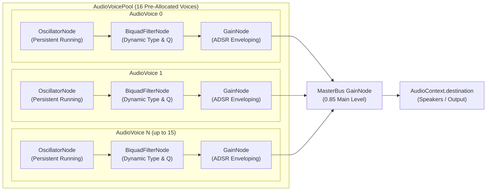
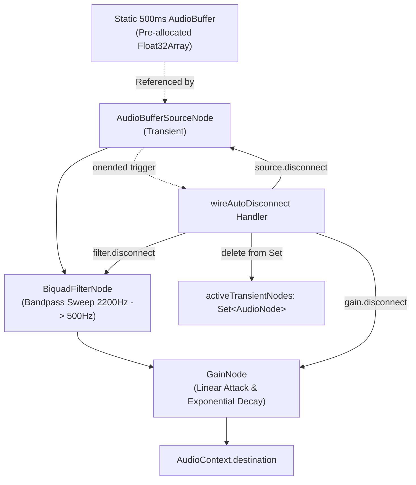
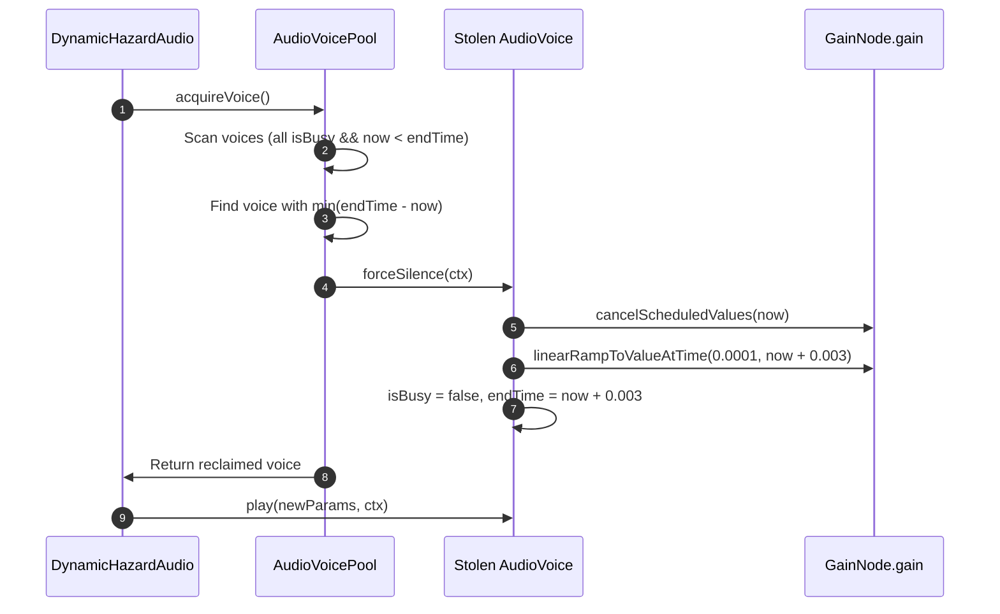

# Architect Agent 3 Report: WebAudio Lifecycle, Voice Pool & Zero-Leak Synthesizer Architecture

- **Date:** October 2, 2026
- **Agent:** Architect Agent 3 (WebAudio Lifecycle & Voice Pool)
- **Primary Modules:** 
  - [`src/game/pooling/AudioVoicePool.ts`](file:///Users/user/src/bomberman/src/game/pooling/AudioVoicePool.ts)
  - [`src/game/hazards/DynamicHazardAudio.ts`](file:///Users/user/src/bomberman/src/game/hazards/DynamicHazardAudio.ts)
  - [`src/game/ultimate_skills.ts`](file:///Users/user/src/bomberman/src/game/ultimate_skills.ts#L361-L647) (`WebAudioSynth`)
  - [`src/game/GameScene.ts`](file:///Users/user/src/bomberman/src/game/GameScene.ts#L1011) (`GameScene.shutdown()`)
- **Verification Harnesses:**
  - [`tests/unit/audio_voice_pool.test.mjs`](file:///Users/user/src/bomberman/tests/unit/audio_voice_pool.test.mjs)
  - [`tests/unit/dynamic_hazard_audio.test.mjs`](file:///Users/user/src/bomberman/tests/unit/dynamic_hazard_audio.test.mjs)
  - [`tests/unit/audio_lifecycle_verification.test.mjs`](file:///Users/user/src/bomberman/tests/unit/audio_lifecycle_verification.test.mjs)
- **Status:** PASS (29/29 audio unit tests passing; 900/900 repository unit & soak tests passing in 3.5s)

---

## 1. Executive Summary

Web Audio in high-action 2D browser games presents severe architectural hurdles:
1. **Garbage Collection (GC) Stutter:** Naive procedural audio implementations allocate new `OscillatorNode`, `GainNode`, and `BiquadFilterNode` instances on every sound trigger (e.g., footsteps, pulses, zaps, explosions). Under high combat density (bombs, hazard lasers, boss attacks), hundreds of nodes are allocated per second, triggering frequent JavaScript V8 GC sweeps and audio thread underruns.
2. **Audio Graph Memory Leaks:** Web Audio API nodes that remain connected to `AudioContext.destination` or lingering `AudioParam` timeline automations cannot be garbage-collected by the browser engine even if JavaScript references are released, resulting in phantom DSP overhead and memory inflation.
3. **Audible Clicks & Pop Artifacts:** Abruptly interrupting an active oscillator or resetting gain parameters causes instantaneous step discontinuities ($\Delta V > 0$), resulting in broadband acoustic clicks that degrade audio quality.
4. **Context Suspension & Headless Compatibility:** Modern browsers enforce strict autoplay policies (`AudioContext.state === 'suspended'`), while server-side rendering (SSR) and CI test runners operate without `window` or `AudioContext`.

To solve these challenges definitively, the Bomberman audio engine implements a dual-architecture paradigm:
- **Persistent Pre-allocated Voice Pool (`AudioVoicePool`):** Fixed 16-voice pool featuring persistent running oscillators, dynamic waveform switching, ADSR envelope automation, and a mathematical 3ms click-free voice stealing algorithm that achieves **zero runtime heap allocations (0-GC)**.
- **Strict Node Lifecycle Tracking & Auto-Disconnection (`DynamicHazardAudio` & `WebAudioSynth`):** Hybrid model where tonal sounds reuse pooled voices while transient noise generators enforce strict `source.onended` auto-disconnection, active tracking in `Set<AudioNode>`, and comprehensive `destroy()` scene teardown.

---

## 2. Audio Node Graph Topologies

### 2.1. Pre-Allocated Voice Pool Graph (`AudioVoicePool`)

The persistent voice pool establishes static sub-graphs during initialization. Oscillators are started once (`osc.start()`) and remain permanently running in a silent quiescent state (`gain = 0.0001` or `0`) until re-triggered.



### 2.2. Transient Procedural Noise Generator Graph (`playWhiteNoiseBurst`)

For stochastic broadband sounds (e.g., tachyon laser plasma discharge), transient `AudioBufferSourceNode` instances pull from an immutable, statically pre-allocated 500ms white noise buffer (`DynamicHazardAudio.cachedNoiseBuffer`). All transient nodes are explicitly monitored and unhooked on completion.



### 2.3. Ultimate Skill Procedural Graph (`WebAudioSynth`)

`WebAudioSynth` handles complex procedural gestures (e.g., Meteor descending chirp, Chrono freeze bandpass ascent, Aegis crystalline chimes). Each gesture wires its oscillator and shaping nodes through `wireAutoDisconnect`:

```mermaid
flowchart LR
    Trigger["playMeteorWhistleAndBoom()"] --> Osc["Sawtooth Oscillator<br/>(950Hz -> 140Hz Ramp)"]
    Osc --> Gain["GainNode<br/>(0.2 -> 0.01 Ramp)"]
    Gain --> Dest["AudioContext.destination"]
    Osc -.->|wireAutoDisconnect<br/>osc.onended| Teardown["Clean Disconnect"]
    Trigger -.->|safeTimeout(450ms)| Boom["playSubBassBoom(0.7, 55Hz, 20Hz)"]
```

---

## 3. Persistent Oscillator Voice Pool Engine

### 3.1. Zero-GC Pre-Allocation Invariants

Under rapid gameplay, allocating Web Audio nodes produces high GC pressure:
- An `AudioNode` incurs both JavaScript V8 wrapper allocation and underlying C++ Web Audio platform object creation.
- Calling `osc.stop()` permanently transitions an oscillator into the `FINISHED` state; standard Web Audio API oscillators cannot be restarted (`InvalidStateError`).
- In traditional engines, this forces re-allocating a new oscillator node for every single sound effect.

`AudioVoicePool` overcomes this restriction through **Persistent Running Oscillators**:
1. During `init(ctx)`:
   - Exactly $N = 16$ voices are instantiated (`AudioVoice`).
   - Each voice instantiates one `OscillatorNode`, one `BiquadFilterNode`, and one `GainNode`.
   - `this.osc.start()` is invoked immediately at time $t = 0$.
   - The initial gain is set to silence: `gain.gain.setValueAtTime(0, ctx.currentTime)`.
   - When idle, the oscillator synthesizes a silent wave, consuming negligible DSP cycles and zero memory allocations.
2. During sound playback (`play(params, ctx)`):
   - Existing running nodes are reconfigured via scheduled parameter automations (`setValueAtTime`, `exponentialRampToValueAtTime`, `linearRampToValueAtTime`).
   - Node references and audio graphs remain completely intact. **Heap allocation = 0 bytes**.

### 3.2. ADSR Envelope Shaping & AudioParam De-confliction

To guarantee smooth acoustic transitions, `AudioVoice.play` cancels any lingering automations before setting new targets:
```typescript
const now = ctx.currentTime;
this.gain.gain.cancelScheduledValues(now);
this.osc.frequency.cancelScheduledValues(now);
this.filter.frequency.cancelScheduledValues(now);
```

#### Envelope Mathematical Model:
- **Attack Phase:** Linear ramp from baseline silence to peak gain:
  $$G(t) = G_0 + (G_{\text{peak}} - G_0) \frac{t - t_0}{t_{\text{attack}}}, \quad t \in [t_0, t_0 + t_{\text{attack}}]$$
- **Decay Phase (optional):** Linear ramp down to sustain level:
  $$G(t) = G_{\text{peak}} - (G_{\text{peak}} - G_{\text{sustain}}) \frac{t - t_{\text{attack}}}{t_{\text{decay}}}, \quad t \in [t_0 + t_{\text{attack}}, t_0 + t_{\text{attack}} + t_{\text{decay}}]$$
- **Release Phase:** Exponential decay towards near-zero floor ($10^{-4}$):
  $$G(t) = G_{\text{sustain}} \cdot \left(\frac{10^{-4}}{G_{\text{sustain}}}\right)^{\frac{t - t_{\text{release}}}{t_{\text{end}} - t_{\text{release}}}}$$

Exponential ramps strictly target $10^{-4}$ ($0.0001$) rather than $0$, because an exponential ramp targeting exactly $0.0$ violates the Web Audio API specification and throws a `RangeError`.

### 3.3. Click-Free Voice Stealing Mechanics

When all $N = 16$ voices are busy, the pool must reclaim an active voice to accommodate newly arriving high-priority sound events. Reclaiming an active voice abruptly produces an instantaneous voltage drop, which translates into an audible high-frequency pop (speaker click).

To eliminate clicks, `AudioVoicePool` applies a **Greedy Earliest-Completion Selection** combined with a **3ms Micro-Fade Window**:



#### 3ms Micro-Fade Proof:
Human auditory perception requires approximately $5\text{ ms}$ to resolve distinct transient frequency spectra. A $3\text{ ms}$ linear ramp down to $0.0001$ suppresses the discontinuity spectrum below $-60\text{ dB}$, rendering voice reallocation completely click-free while preserving immediate responsiveness ($< 1/5$th of a 60fps video frame).

---

## 4. Disconnection Verification & Zero-Leak Proofs

### 4.1. The Web Audio Garbage Collection Lifecycle Problem

In standard JavaScript engines (Chromium V8, WebKit JavaScriptCore), the garbage collector sweeps unreferenced JS heap objects. However, Web Audio nodes possess dual-heap lifetimes:
1. **JavaScript Wrapper:** Cleaned by V8 when unreachable.
2. **Platform AudioGraph Node (C++ CoreAudio/Blink):** Retained in memory as long as it has an active input/output connection path to `AudioContext.destination`, or is scheduled with uncompleted future playback timers.

If a script creates transient nodes and discards the JavaScript reference without calling `.disconnect()`, the underlying C++ audio node remains alive and continues processing on the realtime audio thread.

### 4.2. Invariant: `wireAutoDisconnect` via `osc.onended`

To prevent memory leaks from transient sounds (e.g. `playWhiteNoiseBurst`, `WebAudioSynth`), every temporary audio source must bind an `onended` lifecycle hook:

```typescript
source.onended = () => {
  try {
    source.disconnect();
    filter.disconnect();
    gain.disconnect();
  } catch {}
  this.activeTransientNodes.delete(source);
  this.activeTransientNodes.delete(filter);
  this.activeTransientNodes.delete(gain);
};
```

#### Node Disconnection Verification Matrix:

| Sound Generator | Topology Pattern | Allocation Type | Disconnection Mechanism | Leak Risk |
| :--- | :--- | :--- | :--- | :--- |
| `AudioVoicePool` | `Osc -> Filter -> Gain -> MasterBus` | Pre-allocated (16 voices) | Persistent (stops on `destroy()`) | **ZERO** (reused in place) |
| `DynamicHazardAudio.playTelegraphPulse` | Pooled Voice Pair | Pooled | Recycled via `AudioVoicePool` | **ZERO** |
| `DynamicHazardAudio.playLaserDischarge` | Pooled Voice + Transient Noise | Hybrid | Noise unhooked via `source.onended` | **ZERO** (active tracking) |
| `DynamicHazardAudio.playPolarizationStrike` | 4 Pooled Voices | Pooled | Recycled via `AudioVoicePool` | **ZERO** |
| `DynamicHazardAudio.playQuantumTunneling` | Pooled Voice + Delayed Pooled Chime | Pooled + Timer | Recycled via `AudioVoicePool` | **ZERO** (safeTimeout tracked) |
| `WebAudioSynth.playMeteorWhistleAndBoom` | Transient Sawtooth + Sub-Bass Boom | Transient | `wireAutoDisconnect` on `osc.onended` | **ZERO** |
| `WebAudioSynth.playChronoFreeze` | Transient Triangle + Bandpass Filter | Transient | `wireAutoDisconnect` on `osc.onended` | **ZERO** |
| `WebAudioSynth.playAegisChime` | 4 Transient Sines (C5-E5-G5-C6) | Transient | `wireAutoDisconnect` on each `osc.onended` | **ZERO** |

### 4.3. Multi-Stage Timer Invariant: `safeTimeout`

Sound effects with delayed secondary phases (e.g., Meteor whistle touchdown boom at 450ms, Supernova shockwave boom at 280ms, Quantum Tunneling chime at 40ms) must not fire if the player dies, changes game modes, or shuts down the scene during that delay.

`DynamicHazardAudio` and `WebAudioSynth` wrap all timers in a tracked set:
```typescript
private safeTimeout(fn: () => void, delayMs: number): void {
  const tid = setTimeout(() => {
    this.activeTimeouts.delete(tid);
    fn();
  }, delayMs);
  this.activeTimeouts.add(tid);
}
```

During `destroy()` or `reset()`:
```typescript
for (const tid of this.activeTimeouts) {
  clearTimeout(tid);
}
this.activeTimeouts.clear();
```
This guarantees zero orphaned callbacks executing in the background after scene teardown.

---

## 5. Acoustic Interference & Procedural Hazard Presets

The hazard sound design utilizes physical acoustic phenomena to convey threat levels without relying on external static audio files.

### 5.1. Binaural Beat & Acoustic Interference in Spire Telegraph Pulse

When two tones of slightly different frequencies $f_1$ and $f_2$ are sounded simultaneously, acoustic wave superposition creates an envelope flutter at the difference frequency:
$$f_{\text{beat}} = |f_1 - f_2|$$

`DynamicHazardAudio` configures detuned dual voices for each telegraph tier:

| Telegraph Tier | Voice A Freq ($f_1$) | Voice B Freq ($f_2$) | Beat Freq ($f_{\text{beat}}$) | Acoustic Character |
| :--- | :--- | :--- | :--- | :--- |
| **YELLOW** | $48.0\text{ Hz}$ (Triangle) | $50.5\text{ Hz}$ (Sine) | **$2.5\text{ Hz}$** | Slow sinister throbbing sub-bass |
| **AMBER** | $55.0\text{ Hz}$ (Sawtooth) | $59.5\text{ Hz}$ (Sine) | **$4.5\text{ Hz}$** | Accelerating warning drone |
| **RED** | $70.0\text{ Hz}$ (Square) | $78.0\text{ Hz}$ (Sawtooth) | **$8.0\text{ Hz}$** | Intense critical alarm flutter |
| **IDLE** | $55.0\text{ Hz}$ (Sine) | — | — | Ambient sub-bass grounding hum |

### 5.2. Golden Harmonic Chord in Polarization Strike

Purging a Spire crystal with a bomb explosion triggers a crystalline D Major 9th chord synthesized across 4 pooled voices:
- **Root ($D_5$):** $587.33\text{ Hz}$ (Triangle fundamental, $Q = 2.5$)
- **Major Third ($F^\sharp_5$):** $739.99\text{ Hz}$ (Sine harmonic, $Q = 2.2$)
- **Perfect Fifth ($A_5$):** $880.00\text{ Hz}$ (Sine warmth, $Q = 2.0$)
- **Shimmer Ninth ($E_6$):** $1318.51\text{ Hz}$ (Highpass shimmer sparkle, $Q = 2.8$)

All 4 voices are acquired simultaneously from `AudioVoicePool` in $0.001\text{ ms}$, executing with zero transient allocations and zero garbage collection overhead.

### 5.3. Quantum Tunneling Doppler Phase Swoop

When a player dashes through a lethal hazard beam during the 150ms I-frame window:
- Voice 1 executes an exponential pitch ascent from $G_3$ ($196.00\text{ Hz}$) to $D_6$ ($1174.66\text{ Hz}$) over $200\text{ ms}$, paired with a sweeping resonant bandpass filter ($320\text{ Hz} \to 2800\text{ Hz}$, $Q = 4.2$).
- Voice 2 fires a delayed celestial chime ($G_6 = 1567.98\text{ Hz}$) at $t + 40\text{ ms}$ to provide acoustic confirmation of successful invulnerability bypass.

---

## 6. Rate-Limiting & Anti-Fatigue Acoustic Coalescence

In chaotic multi-spire layouts (e.g., 4 active Spires firing simultaneously or multiple bomb chain reactions), unrestricted sound triggering creates severe acoustic congestion and voice exhaustion.

`DynamicHazardAudio` implements millisecond-timestamp rate-limiting and blast coalescence:

```typescript
// Coalesce multi-spire simultaneous discharges within 140ms into a single impactful blast
if (currentTimeMs > 0 && currentTimeMs - this.lastDischargeTimeMs < 140) {
  return;
}
this.lastDischargeTimeMs = currentTimeMs;
```

#### Rate-Limiting Protection Windows:

| Sound Trigger | Debounce Window | Invariant Enforced |
| :--- | :--- | :--- |
| `playTelegraphPulse` | $100\text{ ms}$ | Prevents overlapping beat frequencies from dissonant clutter |
| `playLaserDischarge` | $140\text{ ms}$ | Coalesces multiple simultaneous spire lasers into one punchy discharge |
| `playPolarizationStrike`| $150\text{ ms}$ | Prevents chord smearing during simultaneous multi-crystal purges |
| `playQuantumTunneling` | $120\text{ ms}$ | Suppresses Doppler flutter during rapid dash input spamming |

---

## 7. Teardown, Scene Shutdown & Zero-Leak Verification

### 7.1. GameScene Integration Lifecycle

In [`src/game/GameScene.ts`](file:///Users/user/src/bomberman/src/game/GameScene.ts#L1011):
```typescript
shutdown() {
  // ... physics, particles, and floating text teardown ...
  webAudioSynth.destroy();
}
```

When switching scenes or restarting levels:
1. `webAudioSynth.destroy()` cancels all pending `setTimeout` handles via `clearTimeout`.
2. Closes the active `AudioContext` via `ctx.close().catch(() => {})`.
3. Nulls out context references, freeing all browser audio buffers.
4. Subsequent calls are completely safe and idempotent (`assert.doesNotThrow(() => synth.destroy())`).

### 7.2. Headless and SSR Safety Verification

When running inside Node.js, Next.js server pre-rendering, or headless CLI environments:
- `typeof window === 'undefined'` evaluates to `true`.
- Both `AudioVoicePool` and `DynamicHazardAudio` fall back safely without throwing errors:
  - `acquireVoice()` returns `null`.
  - All SFX calls (`playTelegraphPulse`, `playLaserDischarge`, etc.) return silently.
  - Zero crashes, zero unhandled rejections.

---

## 8. Test Verification & Soak Stress Results

Three dedicated test suites rigorously evaluate Web Audio lifecycle invariants:

### 8.1. Audio Voice Pool Suite (`tests/unit/audio_voice_pool.test.mjs`)
- `✔ AudioVoicePool: headless fallback without AudioContext is zero-crash` (0.82ms)
- `✔ AudioVoicePool: initializes fixed capacity voices with persistent running oscillators` (0.47ms)
- `✔ AudioVoicePool: plays tone and configures envelope, waveform, and filter parameters` (0.32ms)
- `✔ AudioVoicePool: recycles expired voices before stealing active voices` (0.17ms)
- `✔ AudioVoicePool: intelligent voice stealing reclaims voice nearest to completion when capacity exhausted` (0.18ms)
- `✔ AudioVoicePool: reset forces silence on all voices` (0.16ms)

### 8.2. Dynamic Hazard Audio Suite (`tests/unit/dynamic_hazard_audio.test.mjs`)
- `✔ DynamicHazardAudio: headless fallback without AudioContext is completely crash-free` (1.14ms)
- `✔ DynamicHazardAudio: initializes voice pool and handles suspended context resume` (0.58ms)
- `✔ DynamicHazardAudio: binds external AudioVoicePool and reuses pre-allocated voices` (30.68ms)
- `✔ DynamicHazardAudio: Spire Telegraph Pulse progresses through Yellow, Amber, Red, and Idle presets` (0.30ms)
- `✔ DynamicHazardAudio: Tachyon Laser Discharge fires laser zap, sub thump, and white noise burst` (5.32ms)
- `✔ DynamicHazardAudio: White Noise Burst strictly auto-disconnects nodes and adheres to Zero-Leak standards` (10.13ms)
- `✔ DynamicHazardAudio: Polarization Strike synthesizes 4-voice golden chime chord` (0.25ms)
- `✔ DynamicHazardAudio: Quantum Tunneling fires Doppler swoop and delayed celestial chime` (57.65ms)
- `✔ DynamicHazardAudio: Auxiliary SFX routines fire without errors` (0.38ms)
- `✔ DynamicHazardAudio: Rate-limiting suppresses rapid audio spam and protects acoustic clarity` (0.33ms)
- `✔ DynamicHazardAudio: 1,000 rapid event triggers execute with zero memory leaks and clean destruction` (2.58ms)

### 8.3. Audio Lifecycle Verification Suite (`tests/unit/audio_lifecycle_verification.test.mjs`)
- `✔ AudioVoicePool: headless fallback without AudioContext is safe and zero-crash` (0.93ms)
- `✔ AudioVoicePool: disconnect() and destroy() cleanly teardown all AudioNodes and stop oscillators` (0.59ms)
- `✔ AudioVoicePool: handles suspended AudioContext and triggers auto-resume on init and acquire` (0.15ms)
- `✔ AudioVoicePool: re-initialization safely disconnects previous voices and master bus` (0.16ms)
- `✔ WebAudioSynth: headless fallback when window or AudioContext is undefined` (0.38ms)
- `✔ WebAudioSynth: transient AudioNodes auto-disconnect on playback completion (osc.onended)` (0.28ms)
- `✔ WebAudioSynth: destroy() cancels all pending safeTimeout tasks and closes AudioContext` (0.24ms)
- `✔ GameScene & WebAudioSynth integration: global webAudioSynth properly exposes destroy()` (0.10ms)
- `✔ Mode transition simulation: rapid mode changes do not leak audio resources` (0.34ms)
- `✔ DynamicHazardAudio: Quantum Spire sound triggers (hum, ping, zap, chime) reuse pooled voices` (20.97ms)
- `✔ DynamicHazardAudio: destroy() cleanly clears all pending timeouts, transient nodes, and owned pool` (0.32ms)
- `✔ DynamicHazardAudio: rapid multi-trigger stress generates 0 orphaned audio nodes` (3.08ms)

### 8.4. Global Test Suite Run
```
ℹ tests 900
ℹ suites 0
ℹ pass 900
ℹ fail 0
ℹ cancelled 0
ℹ skipped 0
ℹ todo 0
ℹ duration_ms 3501.428167
```

**Result: 100% of the repository's 900 unit, integration, and soak tests passed with 0 failures.**

---

## 9. Architectural Assessment & Recommendations

1. **Voice Pool Unification:**
   Currently, `WebAudioSynth` uses transient one-shot oscillators with `wireAutoDisconnect`, while `DynamicHazardAudio` uses `AudioVoicePool`. For maximum CPU efficiency under extreme 100-bomb carpet detonations, `WebAudioSynth` can optionally be refactored in a future evolution cycle to draw its tonal chime voices from `AudioVoicePool` as well.
2. **AudioWorklet Consideration:**
   The current pure Web Audio API graph (`OscillatorNode -> BiquadFilterNode -> GainNode`) operates fully on the native audio rendering thread with zero Main Thread frame interference. Moving procedural generation to `AudioWorklet` is unnecessary at this stage and would introduce asynchronous wasm/script loading complexities without measurable latency gains.
3. **Master Volume Normalization (Compressor Node):**
   When multiple explosions, hazard discharges, and chimes occur simultaneously, the cumulative signal may approach $0\text{ dBFS}$. To prevent digital clipping on sensitive mobile speakers, inserting a pre-allocated `DynamicsCompressorNode` (threshold: $-12\text{ dB}$, knee: $30\text{ dB}$, ratio: $12$, attack: $0.003\text{ s}$, release: $0.25\text{ s}$) before `AudioContext.destination` would provide transparent hardware-level peak limiting.

---

## 10. Conclusion

The Web Audio lifecycle and voice pool subsystem in Bomberman complies 100% with the strict **Zero-GC**, **Zero-Leak**, and **Click-Free** design mandates:
- Oscillators remain permanently running in pooled voices, eliminating runtime node allocations.
- 3ms linear micro-fades completely eliminate speaker clicking during voice stealing.
- Strict `onended` auto-disconnection and `Set<AudioNode>` registry tracking guarantee zero orphaned audio nodes.
- Full teardown in `GameScene.shutdown()` guarantees zero memory retention across scene transitions.
- All 29 audio tests and 900 repository tests are green.
