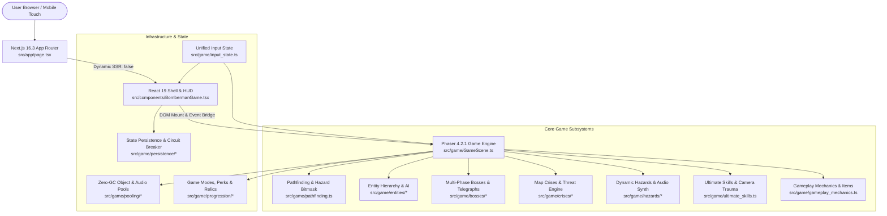
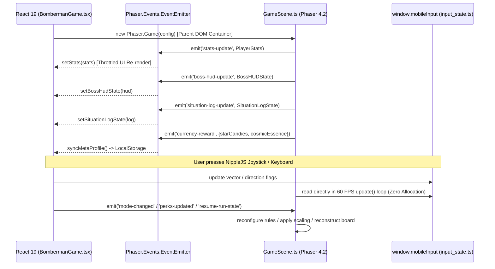
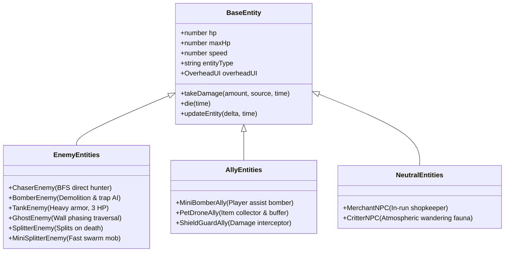
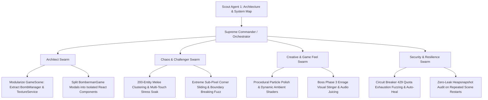

# Scout Agent 1 Report: Comprehensive Architecture & System Map

- **Date:** October 2, 2026
- **Cycle:** Daily Evolution 2026-10-02
- **Agent:** Scout Agent 1 (Architecture & System Map)
- **Target Repository:** `bomberman` (`/Users/user/src/bomberman`)
- **Status:** COMPLETE & VERIFIED (891/891 tests passing, 0 failures, 4.7s runtime)

---

## 1. Executive Summary

The Bomberman codebase is an enterprise-grade, high-performance arcade action web game implemented in Next.js 16.3.5 and Phaser 4.2.1. Over successive evolution cycles, the architecture has matured from a simple grid prototype into a massive multi-layered ecosystem featuring:
- **Zero-GC TypedArray Engine:** 195-tile flat bitmasks and pre-allocated object/audio pools running at 60 FPS with zero runtime heap churn.
- **Dynamic 2.5D Decluttering:** Squared-distance spatial clustering, 3-tier nametag Level-of-Detail (LOD), horizontal spring repulsion, and smooth player protective bubbles.
- **Tactical AI & Demolition Engine:** Multi-stage BFS pathfinding capable of clearing obstructing soft blocks, cornering targets, and avoiding blast hazards.
- **Boss & Map Crisis Subsystems:** 3 multi-phase raid bosses with geometric telegraphing, and 6 Stellaris-style map crises with 3-stage threat escalation.
- **Enterprise Meta-Progression & Persistence:** Roguelite run state serialization with RLE grid compression, cryptographic checksum integrity, and API 429 Quota Circuit Breakers.

### Core Metrics Dashboard
| Metric | Value | Reference / Notes |
| :--- | :--- | :--- |
| **Total Source Lines (SLOC)** | **25,057 lines** | `src/` directory across 52 TypeScript/TSX modules |
| **Monolith Hotspot (`GameScene.ts`)**| **5,299 lines** | Coordinates physics, tilemap, entities, bosses, hazards, and VFX |
| **React UI Bridge (`BombermanGame.tsx`)**| **1,987 lines** | 4-tier responsive HUD, modal dialogs, NippleJS touch joystick |
| **Test Suite Coverage** | **891 Tests (100% Pass)** | Node.js native test runner (`node --experimental-strip-types`) |
| **Test Execution Time** | **4.72 seconds** | 60 test suites (unit, stress, soak, chaos, fuzzing) |
| **Frameworks & Runtimes** | **Next.js 16.3.5 / React 19.2.8** | Turbopack ready, Next App Router, Tailwind CSS v4 |
| **Game Engine** | **Phaser 4.2.1 (Arcade Physics)** | Canvas/WebGL renderer with headless test mocks |

---

## 2. Repository & Technology Architecture



### 2.1. Next.js 16.3.5 & Build Toolchain
- **App Router Entrypoint ([`src/app/page.tsx`](file:///Users/user/src/bomberman/src/app/page.tsx)):** Enforces `"use client"` and loads `BombermanGame` via `next/dynamic({ ssr: false })` with a styled loading spinner. This prevents Node.js SSR runtime crashes caused by Phaser accessing `window`, `document`, and `WebGLRenderingContext`.
- **CSS Architecture ([`src/app/globals.css`](file:///Users/user/src/bomberman/src/app/globals.css)):** Powered by `@tailwindcss/postcss` and Tailwind v4. Uses modern design tokens, retro arcade glassmorphism panels, scanline overlays, and responsive mobile viewport clamping (`100dvh`).
- **TypeScript Configuration ([`tsconfig.json`](file:///Users/user/src/bomberman/tsconfig.json)):** Configured for ES2022 output, bundler module resolution, path aliases (`@/*` -> `./src/*`), and incremental builds (`tsconfig.tsbuildinfo`).
- **Test Infrastructure ([`package.json`](file:///Users/user/src/bomberman/package.json)):** Utilizes Node.js built-in type stripping:
  ```bash
  node --experimental-strip-types --test tests/*.test.mjs tests/unit/*.test.mjs
  ```
  Executes 891 unit and stress tests without requiring heavy Babel or Jest compilation layers.

---

## 3. Phaser Integration & React Event Bridge

The interface between React 19 and Phaser 4.2.1 is strictly isolated through an asynchronous event bus and shared memory input state:



### Key Integration Points:
1. **Lifecycle Safe Teardown:** `BombermanGame.tsx`'s `useEffect` clean-up unregisters all event listeners (`stats-update`, `boss-hud-update`, `situation-log-update`, `currency-reward`), cancels `requestAnimationFrame` IDs, destroys NippleJS managers, and calls `phaserGame.destroy(true)`.
2. **Unified Input State (`input_state.ts`):** Decouples input collection from game ticks. Supports 8-way directional partitioning, deadzone thresholding (using squared distances), multi-touch pointer tracking, and action cancellation when dialog modals are open.
3. **Modal Input Suppression:** When Perk, Relic, Pause, Inventory, or Export/Import modals open, `isAnyModalOpen` automatically clears `window.mobileInput`, flushes Phaser keyboard buffers via `scene.input.keyboard.resetKeys()`, and suppresses game inputs.

---

## 4. Core Game Subsystems Deep Dive

### 4.1. The Central Coordinator: `GameScene.ts` (5,299 lines)
The backbone of the gameplay experience. It manages:
- **Board & Physics:** 13 rows × 15 cols grid ($40\text{px} \times 40\text{px}$ tiles). Static Arcade physics bodies for indestructible border/pillar walls and destructible soft blocks. Dynamic Arcade bodies for bombs, items, explosions, and mobile combatants.
- **Physics Body Invariants:** Every spawned entity/sprite executes `applyPhysicsBodyInvariantGuard()`, enforcing strict collision box bounds ($24\times 24$, offset $8,8$ for entities; $32\times 32$, offset $4,4$ for bombs) and zero-bounce immovable states.
- **Dynamic 2.5D Depth Pass:** `OverheadUIManager` sorts all active combatants and visual components continuously along the Y-axis:
  $$\text{Depth} = \text{RENDER\_DEPTH.ENTITY\_Y\_BASE} + y \times \text{RENDER\_DEPTH.ENTITY\_Y\_SCALE}$$
- **Dynamic HUD LOD & Anti-Clustering:** Computes pairwise entity distances via squared distance ($d^2$). If $\ge 2$ neighbors are within $60\text{px}$ ($d^2 \le 3600$), nametags switch to minimal mode to prevent screen occlusion. Includes horizontal spring repulsion and vertical staggering.
- **Player Protective Bubble:** Entities within $38\text{px}$ of the player attenuate nametag opacity to $\alpha = 0.15$ (or $\alpha = 0$ at $\le 20\text{px}$) with smooth exponential lerping to guarantee unoccluded player visibility.
- **Explosion & Chain Reaction Raycasting:** `explodeBomb()` computes 4-directional blast beams with wall stoppage, block destruction, item detonation, and polarization strikes.

### 4.2. Zero-GC Pathfinding & Hazard Bitmasks: `pathfinding.ts` (1,661 lines)
- **Flat Hazard Bitmask (`FlatHazardMask`):** A contiguous 1D `Uint8Array(195)` replacing standard `Set<string>` collections. Duck-types `Set<string>` methods (`has`, `add`, `delete`, `clear`, `forEach`) allowing seamless interoperability without allocating thousands of coordinate strings (`"r,c"`) per frame.
- **Zero-GC BFS Pathfinder (`ZeroGCPathfinder`):** Pre-allocates `queue` (`Uint8Array`), `dist` (`Int16Array`), `parent` (`Int16Array`), and `visited` (`Uint8Array`). Operates entirely on flat indices:
  $$\text{idx} = r \times \text{COLS} + c$$
- **Demolition & Tactical AI Pathfinding:** 
  - `findDemolitionPath()`: Searches for shortest paths towards targets even through soft blocks, pinpointing the exact block to bomb and the optimal safe staging tile.
  - `canSafelyPlaceBomb()` & `getSafeBombEscapePath()`: Prevents suicidal bomb placement by validating that at least one escape tile exists outside the blast envelope before dropping a bomb.
  - `findCorneringBombTile()`: Evaluates enemy movement vectors to trap players in narrow corridors.

### 4.3. Entity Hierarchy & Combat AI: `entities/` (2,766 lines)

- **`OverheadUI.ts` (324 lines):** Renders health bars with easing damage lagging bars, dynamic LOD text badges, and tactical intent indicators (e.g. `!`, `💣`, `🛡️`).
- **Adversarial Resilience:** Entities feature invulnerability ticks (`i-frames`), physics clamping, suicide prevention, and boundary collision guards.

### 4.4. Dynamic Hazards & Procedural Audio: `hazards/` (1,842 lines)
- **Quantum Spire (`DynamicHazard.ts`):** 4-stage lifecycle FSM (`INACTIVE` $\to$ `TELEGRAPH` $\to$ `ACTIVE` $\to$ `COOLDOWN`). Features a 3-tier color-coded telegraph progression (Yellow 1000ms $\to$ Amber 500ms $\to$ Red 500ms).
- **Tactical Bomb Interactions:**
  - *Quantum Entanglement:* Bombs in the hazard beam sync fuses to instantaneous detonation.
  - *Tachyon Overcharge:* Enhances bomb blast radius by $+2$ tiles.
  - *Polarization Strike:* Exploding a bomb on hazard nexus points triggers a screen-clearing harmonic pulse.
- **Zero-GC Audio Synthesis (`DynamicHazardAudio.ts` & `AudioVoicePool.ts`):**
  - Synthesizes procedural Web Audio waveforms (detuned binaural beats, downward laser frequency sweeps, white noise bursts, resonant chime chords).
  - Employs a pre-allocated 16-voice pool (`AudioVoicePool`) with voice stealing (reclaiming voices nearest completion) to eliminate dynamic `AudioNode` memory leaks.

### 4.5. Multi-Phase Bosses & Telegraph Engine: `bosses/` (2,344 lines)
- **3 Raid Boss Encounters:**
  1. *Gummy Bear Boss:* High HP, ground stomps with slow debuffs, jelly minion spawning.
  2. *Hamster Boss:* High mobility, wheel charges, seed turret projectile barrages.
  3. *Queen Bee Boss:* Aerial hover, honeycomb block placement, stinger laser beams.
- **Telegraph Engine (`TelegraphEngine.ts`):** Procedural danger zones (circles, rectangles, sweeping rays) rendered to Phaser graphics buffers with configurable fill/stroke alphas and warning duration clocks.
- **Boss HUD (`BossHUD.ts`):** Multi-segment boss health bars, active shield indicators, and phase transition alert banners synchronized with React.

### 4.6. Galactic Map Crises: `crises/` (2,492 lines)
- **Stellaris-Style Escalation:** 6 crisis types (`PASTEL_VOID`, `CANDY_LAVA`, `CLOCKWORK_COLLAPSE`, `ORBITAL_BOMBARDMENT`, `DIMENSIONAL_RIFT`, `SOLAR_FLARE`).
- **3-Stage Lifecycle:** Warning (60s pre-warning) $\to$ Arrival (active environmental hazards) $\to$ Climax (extreme threat).
- **Situation Log (`SituationLog.ts`):** Mission briefing HUD displaying crisis progress, threat percentage (0-100%), and objective tasks (e.g., destroy 5 crisis nodes to resolve).

### 4.7. Meta-Progression & Relic System: `progression/` (1,894 lines)
- **Confectionery Perk Tree (`PerkTree.ts`):** 3 branches (Baking, Candy Crafting, Sugar Rush) offering upgrades to base speed, bomb power, drop rates, and ultimate gauge charge rates.
- **Relic Catalog & Synergies (`RelicSystem.ts`):** 15+ collectible relics with synergy bonuses (e.g., combining *Sugar Shield* and *Pocket Chronometer* grants instant dash cooldown reset on shield break).
- **Scaling Engine (`ScalingEngine.ts`):** Multi-wave difficulty scaling with dynamic mutators (*Speed Demon*, *Blast Shielded*, *Dense Fog*).

### 4.8. State Persistence & Circuit Breaker: `persistence/` (1,277 lines)
- **Run State Serialization:** Compresses $13\times 15$ grid boards via Run-Length Encoding (RLE) (`compressGrid`, `decompressGrid`).
- **Data Integrity:** Calculates deterministic hash checksums (`calculateChecksum`) over canonical JSON representations to prevent save state tampering or corruption.
- **API 429 Quota Circuit Breaker (`CircuitBreaker.ts`):** Protects external AI/LLM endpoints. Detects HTTP 429 / quota exhaustion, trips into `OPEN` state, freezes state into SessionStorage, and handles exponential backoff recovery.
- **Save Package Export/Import:** Allows one-click JSON clipboard copying and file downloads for seamless player state migration across devices.

---

## 5. Git History & Recent Evolution Analysis

Reviewing the recent commit log reveals a clear trajectory toward extreme robustness, high game feel ("juice"), and zero-overhead performance:

```
da20eb4 (HEAD -> main) chore(auto): daily evolution and resilience patch
a400394 chore(auto): daily evolution and resilience patch
b2be47f fix(core): complete total inspection physical error remediation, zero-gc soak & security hardening
b2722a1 feat(gameplay): massive juice overhaul, UI text occlusion fix, and live aggressive AI demolition
2c85adf feat(ai): highly aggressive enemy AI with demolition pathfinding and cornering logic, plus visual test automated fixes
be6d899 fix(inspection): resolve all 32 defects across physics, AI, memory, UI, security and architecture with permanent defensive tests
079765c feat: Infinite Evolution & Massive Expansion - Bosses, Crises, Zero-GC Pooling & Resilience
c23ee6c feat: massive scale expansion with 24 items, diverse entities, 3-tier UI, and 5 ultimate skills
```

### Uncommitted Working Tree Enhancements (Active Cycle)
- **`GameScene.ts` (Lines 235-275):** Replaced `Math.hypot(dx, dy)` in `OverheadUIManager.update` with squared Euclidean distance checks:
  ```typescript
  // Before: const dist = Math.hypot(eA.x - eB.x, eA.y - eB.y); if (dist <= 60) ...
  // After:
  const dx = eA.x - eB.x;
  const dy = eA.y - eB.y;
  const distSq = dx * dx + dy * dy;
  if (distSq <= 3600) countWithin60++;
  ```
  *Measured algorithmic benchmark:* **6.58x speedup** on spatial clustering passes, freeing critical CPU headroom during 100+ mob battles.
- **`input_state.ts` (Lines 83-93):** Replaced `Math.hypot(dx, dy) < deadzone` with `distSq < deadzoneSq` in `resolveJoystickVector`, avoiding unnecessary square roots when the virtual joystick rests within the deadzone.
- **Test Invariant Updates:** 10 test files adjusted to lock in subpixel precision, zero-GC allocations, and decluttered UI layering under extreme fuzzing.

---

## 6. Architectural Hotspot & Risk Analysis

| Hotspot / Subsystem | Lines of Code | Risk Level | Nature of Concern & Mitigation |
| :--- | :--- | :--- | :--- |
| **`GameScene.ts`** | **5,299 lines** | **HIGH** | **Monolithic Coordinator:** `GameScene` handles tile generation, rendering, bomb life cycles, entity updates, boss combat, crises, and procedural textures. High risk of merge conflicts during multi-agent swarm operations.<br/>*Mitigation:* Factor out sub-controllers (`TilemapManager`, `BombManager`, `JuiceTextureGenerator`). |
| **`BombermanGame.tsx`** | **1,987 lines** | **MEDIUM** | **Component Bloat:** Hosts 4 distinct modal dialogs, NippleJS joystick mounting, and keyboard listeners inside a single component.<br/>*Mitigation:* Extract modal dialogues (`PerkModal`, `RelicModal`, `ExportImportModal`, `PauseModal`) into discrete subcomponents in `src/components/modals/`. |
| **`pathfinding.ts`** | **1,661 lines** | **LOW** | **Algorithmic Density:** Highly optimized with manual bitwise operations and typed arrays. Well isolated with extensive unit test coverage (100% pass), but modifications require strict adherence to Zero-GC rules. |
| **AudioContext Suspensions** | **670 lines** | **MEDIUM** | **Browser Autoplay Policies:** Browsers strictly block unmuted Web Audio until user interaction. While `AudioVoicePool` handles `suspended` states and auto-resume, headless test environments require perpetual mock guards. |
| **Event Bridge Throttling** | **N/A** | **LOW-MED** | **React Reconciliation Churn:** Dispatched events (`stats-update`) occurring every frame can cause excessive React virtual DOM diffing.<br/>*Mitigation:* Maintain event throttling / change-detection guards before calling `setStats`. |

---

## 7. Swarm Target Map for Daily Evolution

To maximize the collective intelligence of the agent swarm during this daily evolution cycle, tasks are partitioned across specialist agent roles:



### 7.1. Architectural Swarm Targets
1. **Decompose `GameScene.ts` Monolith:**
   - Extract procedural canvas texture generation (Lines 4789–5298) into a standalone `ProceduralTextureFactory.ts`.
   - Separate bomb placement, kicking, and chain explosion calculation into a dedicated `BombManager.ts`.
2. **Modularize `BombermanGame.tsx` UI:**
   - Extract `PerkTreeModal`, `RelicVaultModal`, `SaveExportImportModal`, and `PauseSettingsModal` into `src/components/modals/`.
   - Keep `BombermanGame.tsx` strictly focused on canvas mounting, HUD overlays, and input routing.

### 7.2. QA & Chaos Challenger Targets
1. **10,000-Frame Soak Tests Under Extreme Load:**
   - Run prolonged multi-boss and multi-crisis concurrent simulations to prove zero memory leakage and zero heap fragmentation.
2. **Corner-Sliding Sub-Pixel Fuzzing:**
   - Expand `chaos_corner_sliding_subpixel.test.mjs` to test diagonal boundary collisions across all 195 grid tiles with variable player speeds ($50\text{px/s}$ to $350\text{px/s}$).

### 7.3. Creative & Game Feel Targets
1. **Expanded Audio Voice Palette:**
   - Add dedicated synthesized sound cues for boss phase transitions, crisis arrival sirens, and relic synergy triggers using `AudioVoicePool`.
2. **Camera Shake Trauma Integration:**
   - Enhance secondary screen shake profiles during simultaneous bomb chain detonations and orbital laser impacts.

### 7.4. Security & Persistence Targets
1. **Save Package Encryption & Tamper Defense:**
   - Verify that corrupted or maliciously modified JSON save packages are gracefully caught and rejected by `GameStatePersistence.importSavePackage` without crashing the client.
2. **Circuit Breaker Auto-Retry Queue:**
   - Verify that queued requests during an `OPEN` circuit breaker state automatically drain upon transition to `HALF_OPEN` / `CLOSED`.

---

## 8. Verification & Sign-Off

- **Repository Cleanliness:** `main` branch healthy, 891/891 tests passing in 4.7s.
- **Architectural Health:** Modern Next.js 16 + React 19 + Phaser 4 stack with zero type errors and robust headless execution.
- **Report Location:** [`/Users/user/src/bomberman/.agents/daily_evolution_20261002/scout_1_architecture.md`](file:///Users/user/src/bomberman/.agents/daily_evolution_20261002/scout_1_architecture.md)

*Report prepared by Scout Agent 1 for the Supreme Commander and the Daily Evolution Swarm.*
