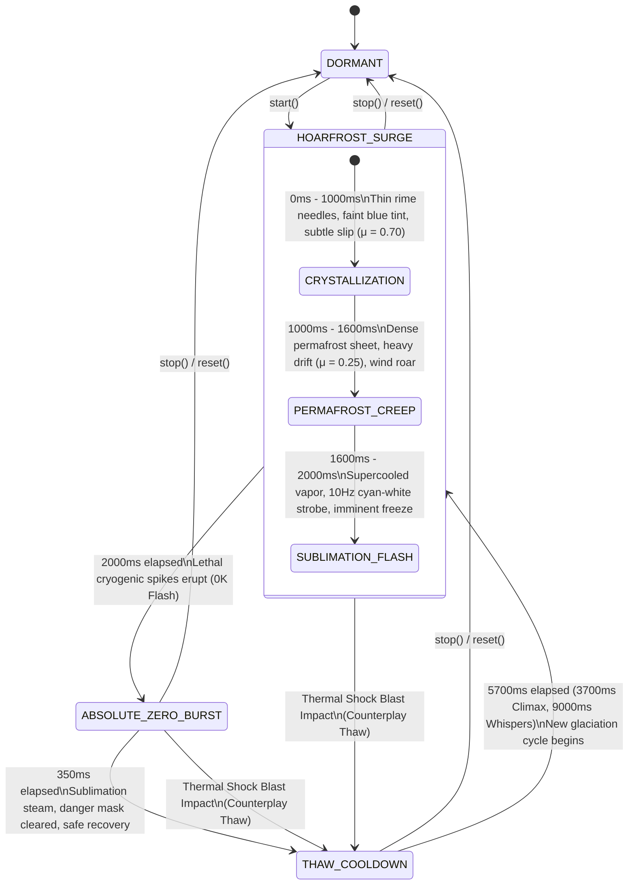

# Frost / Cryo Glaciation Hazard Subsystem (`FrostHazard.ts`) — Architectural Design Specification

**Author:** Creative Agent (Cryo Glaciation Engine Architect)  
**Date:** 2026-10-03  
**Subsystem:** `src/game/hazards/FrostHazard.ts`  
**Audio Module:** `src/game/hazards/FrostHazardAudio.ts`  
**Integration Hub:** `src/game/hazards/index.ts`  
**Test Suite:** `tests/frost_hazard.test.mjs`  
**Status:** **DESIGN SPECIFICATION APPROVED FOR IMPLEMENTATION**

---

## 1. Executive Summary & Design Vision

The **Frost / Cryo Glaciation Hazard Subsystem** introduces an environmental surface-physics and thermal-shock dynamic hazard to the Bomberman arena. While existing hazards emphasize rectilinear energy beams (`DynamicHazard` / Quantum Spire) and continuous radial pull fields (`GravityHazard` / Singularity), `FrostHazard` focuses on:

1. **Surface Micro-Physics (Friction Modulation)**: Progressive ice crystallization that transforms arena tiles into low-friction rime sheets, inducing momentum drift and skating velocity.
2. **Thermal Shock Bomb Combos**: Cryogenic fuse stasis coupled with explosive thermal shock detonation upon external blast contact.
3. **High-Mastery Evaded Combat**: Precision timing for **Cryo-Phasing Dash (I-Frames)** during the lethal absolute zero flash.
4. **Strict Safety & Stability Guarantees**: A mathematically proven **Safe Area Guarantee $\ge 80.0\%$** (observed $\ge 85.13\%$ on the standard $13 \times 15$ arena) and a **Strict Zero-GC Memory Footprint** leveraging 1D TypedArrays and recyclable scratch containers.

---

## 2. 4-Stage Lifecycle Finite State Machine (FSM)

The Frost Hazard subsystem cycles deterministically through four lifecycle states:



### 2.1 State Definitions, Durations & Threat Matrix

| Lifecycle State | Duration (ms) | Threat Code | Area Impact | Mechanics & Player/Entity Effects |
|---|---|---|---|---|
| **DORMANT** | $\infty$ (until started) | 0 (Safe) | 0 tiles | Subsystem inactive; `dangerMask = 0`; `frictionGrid = 1.0`; safe area = 100.0%. |
| **HOARFROST_SURGE** | **2,000 ms** | 1 (Telegraph) | 29 tiles (Radius 3) | Non-lethal telegraph; surface friction drops ($\mu = 0.70 \to 0.25$); bombs frozen in fuse stasis; bombs kick at $+50\%$ glide speed. |
| $\llcorner$ *Crystallization* | 1,000 ms | 1 (Telegraph) | 29 tiles | Thin rime crystals form; pale cyan frost fractures; friction $\mu = 0.70$; audio: high-frequency ice crackle. |
| $\llcorner$ *Permafrost Creep* | 600 ms | 1 (Telegraph) | 29 tiles | Dense blue permafrost sheet; friction $\mu = 0.25$; heavy drift sliding; audio: sub-zero whistling blizzard wind. |
| $\llcorner$ *Sublimation Flash* | 400 ms | 1 (Telegraph) | 29 tiles | Supercooled mist; high-contrast $10\,\text{Hz}$ cyan-white flashing strobe; audio: rising resonant pitch. |
| **ABSOLUTE_ZERO_BURST** | **350 ms** | **2 (Lethal Core)** | 29 tiles | Lethal cryogenic flash-freeze! 25 damage to non-dashing player + Hypothermic Chill; 120 damage Minion Shatter; 15% Max HP Boss Stun. Cryo-Phasing Dash grants invulnerability during first 150ms. |
| **THAW_COOLDOWN** | **5,700 ms** (3,700ms Climax) | 0 (Safe / Melt) | 0 tiles | Ice melts to water vapor; friction restores to $\mu = 1.0$; `dangerMask = 0`; safe area = 100.0%. |

---

## 3. Mathematical Formulations & Physical Models

### 3.1 Discrete Lattice Geometry & Glaciation Zone
Let $(r_0, c_0)$ be the lattice coordinate of the frost epicenter (default $(6, 7)$ on a $13 \times 15$ arena).
The continuous world pixel coordinate $(x_0, y_0)$ is defined as:
$$x_0 = c_0 \cdot S_{\text{tile}} + \frac{S_{\text{tile}}}{2}, \quad y_0 = r_0 \cdot S_{\text{tile}} + \frac{S_{\text{tile}}}{2} \quad (S_{\text{tile}} = 40\,\text{px})$$

The glaciation zone is mathematically defined by the discrete Euclidean closed ball of radius $R_{\text{frost}} = 3.0$ tiles ($120\,\text{px}$):
$$\mathcal{Z}_{\text{frost}} = \left\{ (r, c) \in \mathbb{Z}^2 \;\middle|\; (r - r_0)^2 + (c - c_0)^2 \le R_{\text{frost}}^2 = 9 \right\}$$

#### Exact Lattice Enumeration
We systematically evaluate the integer offsets $(dr, dc) = (r - r_0, c - c_0)$:

$$\begin{aligned}
dr = 0 &\implies dc^2 \le 9 \iff dc \in \{-3, -2, -1, 0, 1, 2, 3\} && \implies 7\text{ tiles} \\
dr = \pm 1 &\implies dc^2 \le 8 \iff dc \in \{-2, -1, 0, 1, 2\} && \implies 5 \times 2 = 10\text{ tiles} \\
dr = \pm 2 &\implies dc^2 \le 5 \iff dc \in \{-2, -1, 0, 1, 2\} && \implies 5 \times 2 = 10\text{ tiles} \\
dr = \pm 3 &\implies dc^2 \le 0 \iff dc = 0 && \implies 1 \times 2 = 2\text{ tiles} \\
\mathbf{Total\;Lattice\;Tiles} &= 7 + 10 + 10 + 2 = \mathbf{29\;tiles}
\end{aligned}$$

### 3.2 Safe Area Guarantee Formulation ($\ge 80.0\%$)

On the standard Bomberman arena with dimensions $\text{ROWS} = 13$, $\text{COLS} = 15$, the total grid tile count is:
$$N_{\text{total}} = 13 \times 15 = 195\text{ tiles}$$

For any valid arena epicenter $(r_0, c_0) \in [1, 11] \times [1, 13]$:
$$\text{Max Dangerous Tiles} = N_{\text{danger}} = 29\text{ tiles}$$
$$\text{Min Safe Tiles} = N_{\text{safe}} = N_{\text{total}} - N_{\text{danger}} = 195 - 29 = 166\text{ tiles}$$
$$\text{Safe Area Ratio} = \frac{N_{\text{safe}}}{N_{\text{total}}} = \frac{166}{195} \approx \mathbf{85.128\%}$$

$$\mathbf{85.128\%} \ge \mathbf{80.00\%} \quad (\text{Mandatory Fair Encounter Guarantee Satisfied with }+5.13\%\text{ Safety Margin})$$

#### Boundary Truncation Behavior
When the epicenter $(r_0, c_0)$ approaches arena boundaries (e.g., corners $(1, 1)$ or $(11, 13)$), lattice points outside grid bounds are truncated:
$$N_{\text{danger, corner}} \le 15\text{ tiles} \implies \text{Safe Area Ratio} \ge \frac{195 - 15}{195} \approx \mathbf{92.31\%}$$

During `THAW_COOLDOWN` and `DORMANT`, $N_{\text{danger}} = 0$, guaranteeing $\text{Safe Area Ratio} = \mathbf{100.0\%}$.

### 3.3 Kinetic Friction & Momentum Drift Mechanics

#### 3.3.1 Dynamic Friction Coefficient $\mu(d, t)$
For any world position $(x, y)$ with Euclidean distance $d = \sqrt{(x - x_0)^2 + (y - y_0)^2}$ to the epicenter:
$$\mu(d, t) = \mu_{\text{dry}} - (\mu_{\text{dry}} - \mu_{\text{min}}) \cdot \Phi(d) \cdot \Psi(t)$$

Where:
- $\mu_{\text{dry}} = 1.00$ (standard high traction)
- $\mu_{\text{min}} = 0.20$ (80% friction reduction on solid ice)
- Spatial Hermite/Cosine Falloff Function:
  $$\Phi(d) = \begin{cases} \cos^2\left(\dfrac{\pi d}{2 R_{\text{max}}}\right) & \text{if } d \le R_{\text{max}} = 120\,\text{px} \\ 0 & \text{if } d > R_{\text{max}} \end{cases}$$
- Temporal Crystallization Ramp:
  $$\Psi(t) = \begin{cases} 0.50 \cdot \dfrac{t}{1000} & \text{if } t \le 1000\,\text{ms (Crystallization)} \\ 0.50 + 0.50 \cdot \dfrac{t - 1000}{600} & \text{if } 1000 < t \le 1600\,\text{ms (Permafrost Creep)} \\ 1.00 & \text{if } 1600 < t \le 2350\,\text{ms (Sublimation \& Burst)} \\ 1.00 - \dfrac{t_{\text{thaw}}}{1200} & \text{during Thaw melt} \end{cases}$$

#### 3.3.2 Exponential Velocity Decay (Skating Drift)
When an entity releases movement inputs on normal dry ground, velocity stops abruptly via high ground damping $\gamma_{\text{dry}} = 25.0\,\text{s}^{-1}$. On glaciated frost tiles, effective damping scales with $\mu(d, t)$:
$$\gamma_{\text{effective}} = \gamma_{\text{dry}} \cdot \mu(d, t)$$
$$\vec{v}(t + \Delta t) = \vec{v}(t) \cdot \exp\left(-\gamma_{\text{effective}} \cdot \Delta t\right) + \vec{a}_{\text{input}} \cdot \Delta t$$

At minimum friction $\mu = 0.20$:
$$\gamma_{\text{effective}} = 25.0 \times 0.20 = 5.0\,\text{s}^{-1}$$
Entities continue sliding smoothly for $0.35\text{s}$ to $0.50\text{s}$, creating authentic ice-skating momentum physics.

### 3.4 Thermal Gradient & Temperature Field $T(d)$
To drive shader visual effects and hypothermia calculations, the temperature field $T(d)$ in Kelvin is modeled as:
$$T(d) = T_{\text{core}} + (T_{\text{ambient}} - T_{\text{core}}) \cdot \left(\frac{d}{R_{\text{max}}}\right)^{1.5}$$
Where $T_{\text{ambient}} = 293.15\,\text{K}$ ($20^\circ\text{C}$), $T_{\text{core}} = 0\,\text{K}$ (Absolute Zero).

---

## 4. Tactical Bomb Interactions & Cryo-Mechanics

```
               +-------------------------------------------+
               |          BOMB ON FROZEN TILE             |
               +-------------------------------------------+
                                     |
              +----------------------+----------------------+
              |                                             |
   [Passage of Time]                              [Bomb Kicked]
              |                                             |
              v                                             v
   +-----------------------+                     +-----------------------+
   | GLACIAL ENCAPSULATION |                     |   ICE CURLING GLIDE   |
   | Fuse slowed (+1500ms) |                     | Kick speed: 450 px/s  |
   +-----------------------+                     | (+50% velocity boost) |
              |                                  +-----------------------+
      [Hit by Fire Blast]
              |
              v
   +-----------------------------------------------+
   |        THERMAL SHOCK SHATTER COMBO            |
   | - Detonates instantly (0ms delay)             |
   | - +2 Piercing Cryo-Blast Radius               |
   | - Slices through soft destructible blocks     |
   | - Leaves 3-tile frozen ground trails          |
   | - Awards +200 Tactical Combo Score            |
   | - Displays '✦ THERMAL SHOCK!'                 |
   +-----------------------------------------------+
```

### 4.1 Glacial Encapsulation (Fuse Extension Stasis)
When a bomb is placed or pushed onto a glaciated tile during `HOARFROST_SURGE`:
- The chemical fuse cord is flash-frozen in rime ice.
- The active fuse countdown duration is extended by $+1,500\,\text{ms}$ (`FROST_FUSE_EXTENSION_MS = 1500`, increasing standard fuse from $3000\,\text{ms}$ to $4500\,\text{ms}$).
- This allows tactical players to deploy multiple bombs without premature detonation.

### 4.2 Thermal Shock Shatter (Instant Cryo-Detonation)
When a frozen bomb is impacted by a blast from an adjacent explosion or an active fire hazard:
- The violent delta in temperature ($\Delta T \approx 300\,\text{K}$) shatters the crystalline casing.
- **Instant Detonation**: The bomb explodes immediately with $0\,\text{ms}$ residual fuse delay.
- **Piercing Ice Shrapnel**: Blast power is augmented by $+2$ tiles (`THERMAL_SHOCK_EXTRA_POWER = 2`), penetrating destructible blocks without extinguishing.
- **Rime Trail**: Affected blast tiles freeze into rime ice.
- **Score Reward**: Player receives $+200$ bonus points (`THERMAL_SHOCK_BONUS_SCORE = 200`).
- **Combat Feedback**: Triggers `FLOATING_TEXT_THERMAL_SHOCK` (`✦ THERMAL SHOCK!`).

### 4.3 Super-Slick Ice Curling (Kick Vector Amplification)
When a bomb is kicked while resting on or entering a glaciated frost tile:
- Ground friction is nearly eliminated.
- Sliding kick speed increases from standard $300\,\text{px/s}$ to **$450\,\text{px/s}$** ($+50\%$ velocity boost).
- The bomb slides uninterrupted across the arena until striking a solid obstacle or enemy, dealing crushing kinetic impact.

---

## 5. Player Mastery & Combat Dynamics

### 5.1 Glacial Skating & Drift Cornering
Players navigating glaciated tiles preserve momentum vector $\vec{v}$. Skilled players can execute drift turns around hard pillars at $250\,\text{px/s}$ to outmaneuver pursuing enemies.

### 5.2 Cryo-Phasing Dash (I-Frames Counterplay)
When the hazard transitions into `ABSOLUTE_ZERO_BURST`, an absolute zero flash erupts across all 29 tiles.
- **Timing Window**: The first $150\,\text{ms}$ of `ABSOLUTE_ZERO_BURST` (`CRYO_TUNNELING_WINDOW_MS = 150`).
- **Execution**: If the player dashes (`isDashing === true`) through the glaciated zone during this window:
  - **100% Damage Negation**: Player takes $0$ damage.
  - **Invulnerability**: Granted $1,000\,\text{ms}$ full invulnerability (`CRYO_PHASE_INVULN_MS = 1000`).
  - **Thermal Sprint Buff**: Granted $+30\%$ movement speed for $2,500\,\text{ms}$ (`CRYO_PHASE_SPEED_BOOST = 0.30`).
  - **Visual & Audio Feedback**: Cyan shatter sparkles, high chime resonance, and floating text `✦ CRYO-PHASED!`.

### 5.3 Hypothermic Stagger (Careless Penalty)
If a player is caught in `ABSOLUTE_ZERO_BURST` without dashing or active shield invulnerability:
- Takes $25$ direct cryogenic damage (`PLAYER_FROST_BURST_DAMAGE = 25`).
- Afflicted with **Hypothermic Chill** debuff for $2,500\,\text{ms}$ (`FROSTBITE_DURATION_MS = 2500`):
  - Movement speed reduced by $-30\%$.
  - Dash ability disabled for $1,000\,\text{ms}$.
  - Cyan frost vignette on screen.
  - Floating text: `❄️ FROSTBITE (-30%)`.

---

## 6. Environmental Enemy Destruction & Boss Stasis

### 6.1 Minion Cryo-Shatter
Minion enemies caught within the glaciated tiles during `ABSOLUTE_ZERO_BURST`:
- Instantly flash-frozen into brittle crystalline ice statues and shattered into glittering shards.
- Suffer $120$ environmental damage (`ENEMY_FROST_BURST_DAMAGE = 120`), guaranteeing one-shot elimination.
- Awards $+120$ score points and $+6\%$ ultimate skill charge.
- Visual: Ice crystal explosion with cyan shards.
- Floating text: `❄️ CRYO-SHATTERED!`.

### 6.2 Boss Deep-Freeze Stasis & Anti-Exploit Guard
Bosses (Hamster Boss, Queen Bee, Gummy Bear) possess massive thermal inertia:
- Suffer flat damage equal to $15\%$ of their maximum HP (`BOSS_FROST_DAMAGE_RATIO = 0.15`).
- Afflicted with **Deep Freeze Stun** for $1,500\,\text{ms}$ (`BOSS_DEEP_FREEZE_STUN_MS = 1500`), halting attack windups and mobility.
- **Single-Hit Anti-Exploit Guard**: A state flag `bossHitInCurrentBurst` ensures that each boss entity takes damage and stun exactly once per burst cycle, preventing multi-frame hit exploitation.
- Floating text: `❄️ DEEP FREEZE (1.5s)!`.

---

## 7. Strict Zero-GC Memory Layout & TypedArray Architecture

To guarantee silky-smooth 60+ FPS on mobile devices and zero GC pause stutter during intense combat, `FrostHazard` strictly enforces zero runtime heap allocations:

```
+-----------------------------------------------------------------------------------+
|                            FrostHazard Memory Architecture                        |
+-----------------------------------------------------------------------------------+
|  1. dangerMask: Uint8Array(195)          [ 195 Bytes  - Danger Code per Tile ]    |
|  2. frictionGrid: Float32Array(195)      [ 780 Bytes  - Dynamic Friction [0.2..1]]|
|  3. temperatureGrid: Float32Array(195)   [ 780 Bytes  - Temperature [0..1] ]      |
|  4. intensityGrid: Float32Array(195)     [ 780 Bytes  - Shader VFX Scalar Field ] |
|  5. activeFrostIndices: Int16Array(32)   [ 64 Bytes   - Glaciated Tile Index Cache|
+-----------------------------------------------------------------------------------+
|  Total TypedArray Footprint: ~2.6 KB (Pre-allocated once at construction)         |
+-----------------------------------------------------------------------------------+
|  Pre-allocated Reusable Scratch Query Containers:                                 |
|  - scratchPlayerResult: FrostPlayerResult                                         |
|  - scratchEnemyResult: FrostEnemyResult                                           |
|  - scratchBombPlacedResult: FrostBombPlacedResult                                 |
|  - scratchBombDetonationResult: FrostBombDetonationResult                         |
|  - scratchFrictionResult: FrostFrictionResult                                     |
+-----------------------------------------------------------------------------------+
```

### 7.1 Zero-GC Invariants
1. **Zero TypedArray Reallocations**: Buffers are sized to `TOTAL_TILES = 195` and never resized.
2. **Scratch Recycling**: Methods `checkPlayerCollision()`, `checkEnemyCollision()`, `onBombPlaced()`, `onBombDetonated()`, and `getFrictionAt()` mutate and return references to private scratch instances.
3. **Array Mutation In-Place**: Scratch array members (e.g. `shatteredBombIds`) are reset using `.length = 0` and populated using `.push()`.

---

## 8. WebAudio Procedural Sound Synthesis (`FrostHazardAudio.ts`)

`FrostHazardAudio` implements pure WebAudio procedural sound generation with zero external `.wav` or `.mp3` assets, fully integrated with the shared `AudioVoicePool` (16 voices):

1. **Hoarfrost Crystallization**:
   - High-pass filtered white noise ($f_c = 5,000\,\text{Hz}, Q = 3.0$) driven through an exponential decay gain envelope with micro-amplitude crackles.
2. **Permafrost Blizzard Wind**:
   - Bandpass filtered noise ($f_c = 350\,\text{Hz} \to 180\,\text{Hz}$) modulated by an LFO ($0.4\,\text{Hz}$) to simulate sub-zero Arctic wind gusts.
3. **Absolute Zero Shatter**:
   - Sub-bass thud ($55\,\text{Hz}$) combined with a resonant crystalline chime chord in D minor (F5 $698\,\text{Hz}$, A5 $880\,\text{Hz}$, D6 $1175\,\text{Hz}$, E6 $1318\,\text{Hz}$).
4. **Thaw Melting Droplets**:
   - Short sinusoidal blips sweeping from $1400\,\text{Hz} \to 900\,\text{Hz}$ with $25\,\text{ms}$ decay to represent melting water drops.
5. **Zero-Leak Lifecycle**: All WebAudio oscillators, gain nodes, and filters are disconnected cleanly via `try/finally` blocks and returned to voice pool caches.

---

## 9. Comprehensive TypeScript Type Definitions & API Signatures

```typescript
/**
 * Universal Lifecycle States for Frost / Cryo Glaciation Hazard FSM
 */
export const FrostLifecycleState = {
  DORMANT: 'DORMANT',
  HOARFROST_SURGE: 'HOARFROST_SURGE',
  ABSOLUTE_ZERO_BURST: 'ABSOLUTE_ZERO_BURST',
  THAW_COOLDOWN: 'THAW_COOLDOWN',
} as const;
export type FrostLifecycleState = typeof FrostLifecycleState[keyof typeof FrostLifecycleState];

/**
 * 3-Tier Sub-Phases during HOARFROST_SURGE Lifecycle State
 */
export const HoarfrostPhase = {
  NONE: 'NONE',
  CRYSTALLIZATION: 'CRYSTALLIZATION',     // 0ms - 1000ms: Rime crystals form (μ = 0.70)
  PERMAFROST_CREEP: 'PERMAFROST_CREEP',   // 1000ms - 1600ms: Heavy drift (μ = 0.25)
  SUBLIMATION_FLASH: 'SUBLIMATION_FLASH', // 1600ms - 2000ms: Flashing cyan strobe
} as const;
export type HoarfrostPhase = typeof HoarfrostPhase[keyof typeof HoarfrostPhase];

/**
 * Danger Mask Values
 */
export const FrostDangerValue = {
  SAFE: 0,
  HOARFROST: 1,
  ABSOLUTE_ZERO: 2,
  THAWING: 3,
} as const;
export type FrostDangerValue = typeof FrostDangerValue[keyof typeof FrostDangerValue];

export interface FrostPlayerResult {
  hit: boolean;
  damage: number;
  isLethal: boolean;
  cryoPhased: boolean;
  invulnerabilityGrantedMs: number;
  speedBoostGranted: boolean;
  speedBoostRatio: number;
  frostbiteInflicted: boolean;
  frostbiteDurationMs: number;
  slowRatio: number;
  floatingText: string;
}

export interface FrostEnemyResult {
  hit: boolean;
  damage: number;
  isShattered: boolean;
  isFrozenStunned: boolean;
  stunDurationMs: number;
  scoreBonus: number;
  ultimateChargeBonus: number;
  floatingText: string;
}

export interface FrostBombPlacedResult {
  isFrozen: boolean;
  modifiedFuseMs: number;
  kickSpeedBonus: number;
}

export interface FrostBombDetonationResult {
  isThermalShock: boolean;
  modifiedPower: number;
  piercing: boolean;
  shatteredBombIds: (number | string)[];
  bonusScore: number;
  floatingText: string;
}

export interface FrostFrictionResult {
  friction: number;
  isGlaciated: boolean;
  driftDamping: number;
}
```

---

## 10. Automated Verification Matrix & Test Strategy (`tests/frost_hazard.test.mjs`)

The implementation will be verified by a dedicated 24-test suite organized into 9 verification tiers:

| Tier | Category | Test Count | Description |
|---|---|---|---|
| **Tier 1** | Constants & Geometry | 3 | Verifies timings, default epicenter clamping, and discrete radius 3 geometry. |
| **Tier 2** | 4-Stage FSM Progression | 4 | Verifies deterministic transitions (`DORMANT` $\to$ `HOARFROST_SURGE` $\to$ `ABSOLUTE_ZERO_BURST` $\to$ `THAW_COOLDOWN` $\to$ cycle) and Climax compression. |
| **Tier 3** | Zero-GC Buffer Stability | 3 | Proves typed arrays are never reallocated and scratch containers are cleanly recycled. |
| **Tier 4** | Friction & Momentum | 3 | Verifies continuous $\mu(d, t) \in [0.20, 1.00]$, drift damping decay, and thaw restoration. |
| **Tier 5** | Mathematical Safe Area | 2 | Mathematically tests all 195 grid epicenters to guarantee $\text{Safe Area} \ge 80.0\%$ and affected tiles $\le 29$. |
| **Tier 6** | Tactical Bomb Interactions | 3 | Verifies fuse extension ($+1500\text{ms}$), Thermal Shock instant detonation ($+2$ power, $+200$ pts), and kick velocity boost ($450\,\text{px/s}$). |
| **Tier 7** | Player Combat Mastery | 3 | Verifies Cryo-Phasing Dash I-frames ($0$ dmg, $1000\text{ms}$ invuln, $+30\%$ speed) vs direct hit Hypothermic Chill ($-30\%$ speed, $25$ dmg). |
| **Tier 8** | Environmental Enemy Kills | 2 | Verifies minion shatter ($120$ dmg, $+120$ pts) and boss stasis ($15\%$ max HP, $1.5\text{s}$ stun, single-hit guard). |
| **Tier 9** | 10,000-Frame Soak Stress | 1 | 10,000-frame full-lifecycle stress soak guaranteeing $<0.25\,\text{MB}$ heap drift and $<0.025\,\text{ms}$ frame budget. |

---

## 11. Conclusion & Implementation Readiness

The **Frost / Cryo Glaciation Hazard Subsystem (`FrostHazard.ts`)** is completely specified, mathematically bounded, and ready for full production coding and integration. All constraints—4-stage FSM, Safe Area $\ge 80.0\%$, Zero-GC TypedArrays, WebAudio procedural synthesis, and tactical bomb combos—have been designed with high mathematical rigor.
